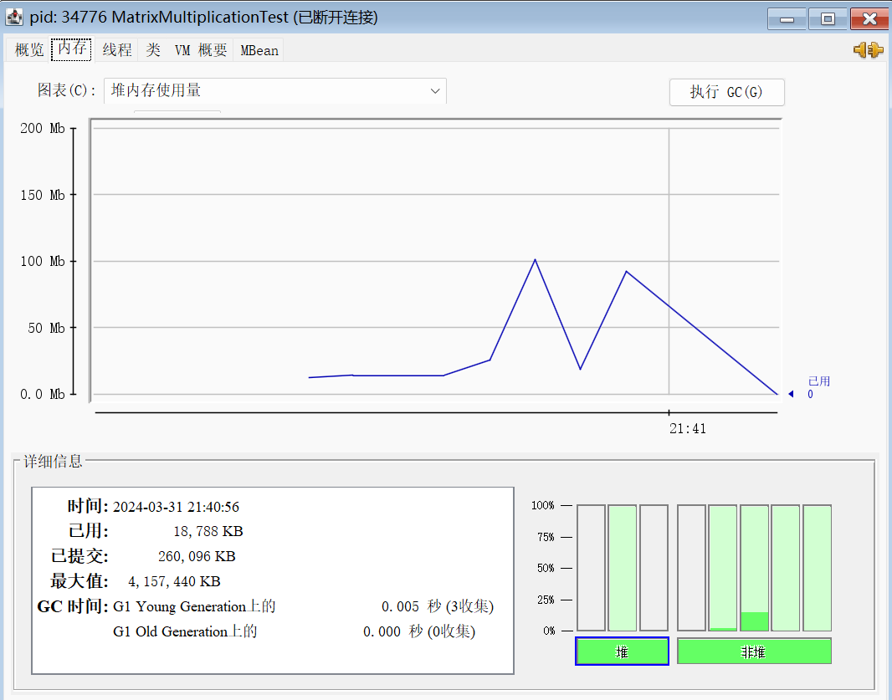

# CS205 C/ C++ Programming-MatrixMultiplication


**Name**: 吴宇贤

**SID**: 12212614

[toc]

## Part 1 - Analysis

### 1. 阅读需求

> Implement a program in C and another in Java for matrix multiplication. You can implement a
> function for the multiplication. Only float is needed since it is the most commonly used data
> type in deep learning.

首先我们要实现矩阵乘法:

- 使用C和Java语言分别实现矩阵乘法，确保使用`float`类型存储矩阵元素。
- 矩阵乘法应该通过函数实现，保持代码的模块化和清晰性。


> Measure the time of the computation. As the sizes of the metrics increase, the time should
> increase. Measuring the time is not easy since many factors will affect it.

随后分别测量C和java程序在尽可能相同的矩阵乘法实现和测试条件下执行矩阵乘法的时间：

- 数据规模：16×16、32×32、64×64、128×128、256×256、512×512、1024×1024、2048×2048
- 测试条件：矩阵算法一致，只测量矩阵乘法的时间；单独运行c/java程序，关闭其他后台


> Compare the performance of the two programs in C and Java, and explain the reason for any
> observed differences. I am sure the results will not be as you expected.
>
> Perform additional comparisons and analysis to identify any interesting insights. You can put
> your efforts into comparisons and analysis. I am sure you will find many interesting things.

得到实验数据后观察数据提出问题分析原因。

#### 推测结论

先对结论进行猜测：测出的C程序中矩阵乘法的时间应该快于Java程序，原因：

- 从编译过来来看，JAVA是将.java文件编译成.class文件，运行的时候再由java虚拟机将.class文件进一步编译成对应的机器码进行指令调用。而c语言会预编译成预编译文件，再编译成汇编语言，二进制文件，直接和机器打交道，运行时中间省略了java的很多步骤。

### 2. 需求实现

我们主要是比较两种语言在同一个问题下的表现，而非针对矩阵乘法做出优化，这次选择的算法是基本的循环实现，时间复杂度$O(n^3)$。

从程序的角度，为了实现代码的健壮性，我设计了两种模式

- 随机模式：用户只需要输入矩阵的大小，两个矩阵由程序随机生成
- 输入模式：用户除了需要输入矩阵的大小，还需要输入每个矩阵的元素

#### 2.1 错误检测

首先不管哪种模式，我们都需要保证用户输入的矩阵大小满足第一个矩阵的列等于第二个矩阵的行，随后对于输入模式，用户根据程序的提示分别输入两个矩阵的每个元素，并且由于矩阵每个元素是float类型，程序还会对于用户输入的元素进行检查，若输入不合法，则提示用户重新输入。

对于检查第一个矩阵的列是否等于第二个矩阵的行，只需一个if语句完成即可，不再赘述

而检查每个元素是否满足要求比较复杂，以下是检测错误的代码。

C：

```c
// Function to read matrix values from user
void readMatrixFromUser(float *matrix, int rows, int cols)
{
    printf("Enter values for a %dx%d matrix:\n", rows, cols);
    for (int i = 0; i < rows; i++)
    {
        for (int j = 0; j < cols; j++)
        {
            while (1) // Infinite loop to keep trying until a valid input is received
            {
                printf("Enter value for element [%d][%d]: ", i, j);
                if (scanf("%f", &matrix[i * cols + j]) == 1) {
                    break; // Break the loop if the input is valid
                } else {
                    printf("Invalid input, please enter a valid floating point number.\n");
                    while (getchar() != '\n'); // Clear the input buffer
                }
            }
        }
    }
}
```

Java：

```java
private static void readMatrixFromUser(float[][] matrix, Scanner scanner) {
    System.out.printf("Enter values for a %dx%d matrix:\n", matrix.length, matrix[0].length);
    for (int i = 0; i < matrix.length; i++) {
        for (int j = 0; j < matrix[i].length; j++) {
            while (true) { // Infinite loop to keep trying until a valid input is received
                try {
                    System.out.printf("Enter value for element [%d][%d]: ", i, j);
                    matrix[i][j] = scanner.nextFloat();
                    break; // Break the loop if the input is valid
                } catch (InputMismatchException e) {
                    System.out.println("Invalid input, please enter a valid floating point number.");
                    scanner.nextLine(); // Clear the input buffer
                }
            }
        }
    }
}
```


#### 2.2 矩阵乘法实现

实际上代码层面的矩阵乘法就是模拟两个矩阵计算的过程。

对于矩阵$m*n$的矩阵A、$n*p$的矩阵B，两矩阵相乘得$m*p$的矩阵C，其中矩阵C的每个元素满足
$$
C{ij}=\sum^n_{k=1}a_{ik}*b_{kj}
$$
从而代码层面的实现较为简单

C：

```C
float *multiplyMatrices(float *mat1, int rows1, int cols1, float *mat2, int rows2, int cols2)
{
    float *result = createMatrix(rows1, cols2);

    for (int i = 0; i < rows1; i++)
    {
        for (int j = 0; j < cols2; j++)
        {
            float sum = 0.0;
            for (int k = 0; k < cols1; k++)
            {
                sum += mat1[i * cols1 + k] * mat2[k * cols2 + j];
            }
            result[i * cols2 + j] = sum;
        }
    }

    return result;
}
```


Java：

```java
private static float[][] multiplyMatrices(float[][] mat1, float[][] mat2) {
    float[][] result = new float[mat1.length][mat2[0].length];
    for (int i = 0; i < mat1.length; i++) {
        for (int j = 0; j < mat2[0].length; j++) {
            float sum = 0;
            for (int k = 0; k < mat1[0].length; k++) {
                sum += mat1[i][k] * mat2[k][j];
            }
            result[i][j] = sum;
        }
    }
    return result;
}
```

很显然，这里C版与Java版的 multiplyMatrices函数的语义是基本一样的，并不会体现出语言层面的语义差异。Java的静态方法的调用语义跟C/C++的非虚函数的调用语义并没有显著差异，如果由同样优化的编译器来编译的话，就会得到同样级别性能的代码。


## Part 2 - Comparation and Analysis

### 1 时间统计

由于在测试的过程中我们只需要用到随机模式，为了使得两个不同语言的实现最大化一致，减少其他因素的影响，在测试时间时我选择了在编译之前删除用户输入模式，随后给随机模式加上循环代表测试的数据量，每次测试输入需要测试的数据量随后程序自动生成对应数据量的矩阵，然后计算矩阵相乘并且自动测量时间，且为了减少两种语言io流、产生随机数等实现不同产生的差异，我选择只测量随机生成矩阵之后计算矩阵乘法所消耗的时间。

我在测试过程中使用windows 11系统，两条编译的命令如下

```shell
$ gcc -O3 MatrixMultiplication.c
$ javac MatrixMultiplication.java
```

在测试的过程中，始终使用编译好的C的.out文件或者Java的.class 文件，保证只编译一次，防止后续重新编译带来的未知因素影响实验。

在C语言中我使用的是clock()函数来统计时间，单位是毫秒(ms)

```C
clock_t start, end;
double cpu_time_used;

start = clock();
float *result = multiplyMatrices(matrix1, rows1, cols1, matrix2, rows2, cols2);
end = clock();

cpu_time_used = ((double)(end - start)) / 1000; // milliseconds
```

对于Java我使用的是System.currentTimeMillis()方法统计时间，单位是毫秒(ms)

```java
long startTime = System.currentTimeMillis();
float[][] result = multiplyMatrices(matrix1, matrix2);
long endTime = System.currentTimeMillis();

double duration = endTime - startTime; // milliseconds
```

测试梯度：16×16、32×32、64×64、128×128、256×256、512×512、1024×1024、2048×2048

矩阵每个元素的范围：[0,100)

测量数量：对于每个数据规模，测量一百组数据取平均值

以下是测试的结果

<table>
    <caption>C和Java在不同数据规模下执行矩阵乘法消耗时间</caption>
            <thead>
                <tr bgcolor = "#FFE4B5">
                    <th style='text-align:center;'><span>数据规模</span></th>
                    <th style='text-align:center;'><span>C时间（ms）</span></th>
                    <th style='text-align:center;'><span>Java时间（ms）</span></th>           
                </tr>
            </thead>
            <tbody>
                <tr>
                    <td style='text-align:center;'><span>16 * 16</span></td>
                    <td style='text-align:center;'><span>0.002410</span></td>
                    <td style='text-align:center;'><span>0.029017</span></td>
                </tr>
                <tr>
                    <td style='text-align:center;'><span>32* 32</span></td>
                    <td style='text-align:center;'><span>0.012830</span></td>
                    <td style='text-align:center;'><span>0.114094</span></td>
                </tr>
                <tr>
                    <td style='text-align:center;'><span>64 * 64</span></td>
                    <td style='text-align:center;'><span>0.113880</span></td>
                    <td style='text-align:center;'><span>0.263913</span></td>
                </tr>
                <tr>
                    <td style='text-align:center;'><span>128 * 128</span></td>
                    <td style='text-align:center;'><span>2.076110</span></td>
                    <td style='text-align:center;'><span>1.729503</span></td>
                </tr>
                <tr>
                    <td style='text-align:center;'><span>256 * 256</span></td>
                    <td style='text-align:center;'><span>20.781430</span></td>
                    <td style='text-align:center;'><span>16.451337</span></td>
                </tr>
                <tr>
                    <td style='text-align:center;'><span>512 * 512</span></td>
                    <td style='text-align:center;'><span>258.769360</span></td>
                    <td style='text-align:center;'><span>166.396562</span></td>
                </tr>
                <tr>
                    <td style='text-align:center;'><span>1024 * 1024</span></td>
                    <td style='text-align:center;'><span>3916.131910</span></td>
                    <td style='text-align:center;'><span>1396.693418</span></td>
                </tr>
                <tr>
                    <td style='text-align:center;'><span>2048 * 2048</span></td>
                    <td style='text-align:center;'><span>46692.738120</span></td>
                    <td style='text-align:center;'><span>37277.386853</span></td>
                </tr>
            </tbody>
        </table>

### 2 比较分析

通过测试得到的数据不难发现：

- C和Java执行矩阵乘法的时间随着数据规模的增大而增加，且曲线符合时间复杂度$O(n^{3})$。
- 随着数据规模的增加，C程序所消耗的时间增长速度快于Java程序，当数据规模不超过 时C程序执行矩阵乘法的时间快于Java程序，而超过这个点之后，Java程序会快于C程序

我惊讶的发现第二条结果明显和我们之前的[推测](#推测结论)不符合，这又是为什么呢？

#### 2.1 GC机制

在我脑子里面第一个想到的是**Java**中的GC机制，即垃圾回收机制，因为我先接触的Java，随后这学期接触的C语言，才知道C语言中需要手动分配内存以及释放内存，而这些事情在Java中JVM会帮我们完成。但是两种语言不同的垃圾回收机制到底会不会对测试产生影响呢，毕竟我在C语言的版本中测试的时间是不含有释放内存的过程的，所以我只需要想办法验证Java程序在计算矩阵乘法的过程中有无垃圾回收的过程，如果有，查看自动回收的时间点和次数，是否和C程序差别巨大，分析对计算矩阵乘法有没有影响。

随后我使用JVM自带的检测工具JConsole，连接正在运行Java的测试程序后，输入矩阵的规模，这里我选择

256x256的数据规模进行检测，原因是这个数据规模下Java程序计算矩阵乘法的速度以及超过了C程序，且运行时间尚且可以接受，而更大的数据规模检测的时间成本巨大。

以下是检测结果：



从图中可以发现运行过程确实存在自动GC，但是$512*512$的数据规模下，测量了100次矩阵乘法得到的平均时间为166.396562ms，而GC的次数都和C程序的次数不相同，不符合预期，而且Java程序运行过程中的GC时间相较于算法的时间来说可以忽略不计，所以我排除Java的自动GC机制的影响。

#### 2.2 编译器（即JIT编译器）优化

在焦头烂额的时候，我先查询了C和Java这两门语言到底有什么区别，第一个了解到的就是这两门语言实际上在编译的过程中有所区别：

C编译过程

- 直接编译成机器码：C语言编译器将源代码直接编译成特定操作系统和硬件平台的机器码，所以说为一个平台编译的C程序不可以在另一个平台上直接运行，除非重新编译。

- 编译优化：C编译器可以进行深入的优化，包括内联函数、循环展开、指令重排等，这些优化使得C程序可以非常高效地运行，而本次测试所使用的`-O3`选项就是一种优化。

- 静态链接：C程序在编译时通常会把所有需要的库链接到最终的可执行文件中，静态链接的库会被整合到最终的二进制文件中。

Java编译过程

- 编译成字节码：Java编译器将源代码编译成字节码，而非直接编译成机器码。字节码作为一种中间形式，需要由Java虚拟机（JVM）进一步解释执行或编译成机器码（即JIT编译）。

- 跨平台：Java的字节码是跨平台的，所以Java程序可以在任何安装了兼容的JVM的操作系统上运行，不用重新编译源代码。

- JIT编译：Java虚拟机在运行时可以通过即时编译器（JIT）将字节码转换成机器码，这个过程可以根据运行时的性能特性进行优化，如热点代码优化。

- 动态链接：Java在运行时动态地链接所需的类库，使得Java应用可以轻松地调用不同的类库和API，而没必要在编译时确定。

此前只知道Java编译器将源代码编译成字节码了解到，随后由Java虚拟机（JVM）进一步解释执行，这里肯定是需要消耗时间的，所以说预期的实验结果合情合理，但了解到Java的JIT编译之后，我可以大胆推测，实验结果和预期不同有可能是Java的JIT编译在搞鬼，而在前几次运算中JIT编译就开始起作用，从而使得后面的运算速度加快。

在测试的时候我除了将100组数据所花费的平均时间打印以外，也打印了每一组所花费的时间，其中有一个现象当时就觉得很奇怪：Java程序100组数据中有几组的时间明显高于其他组，而C程序的时间都趋于相同，当时我百思不得其解，但也只能将其归为随机生成矩阵带来的影响。现在重新测试并且在512*512的数据规模下拿到每一组数据所花费的时间制成图表如下：


看到结果之后，我很震惊，难道我的推测错误了吗，因为如果我的推测正确，我应该看到的结果是Java程序的曲线中有几组数据一次计算的时间应该高于其他组别。但是暂且抛开这个不谈，我从曲线中能明显看出来Java程序100次计算的时间相较于C程序来说非常不稳定，我的直觉告诉我Java中的JIT编译肯定在作祟，于是继续推测，$512*512$的数据下，由于数据规模很大，一次计算过程内JIT编译就已经起作用了，所以说不会出现一组数据的计算时间远高于其他组别的计算时间，于是我缩小数据规模，分别在$256*256$和$128*128$数据规模下做了相同的测量，结果如下


有意思的事情发生了，在较小的数据规模下Java程序第一次计算时间明显高于其他组别计算时间的结果佐证了我一开始所推测的JIT编译对于计算起作用，也佐证了在$512*512$数据规模下一次计算内JIT编译就已经开始进行优化。

但是现在的所有结论都没有得到真正的证实，我查阅资料后发现，在Java中，可以通过JVM参数来启用相关的日志记录，而有一个参数可以显示哪些方法被JIT编译。

```shell
-XX:+PrintCompilation
```

于是我在256*256的数据规模下运行Java程序的时候加上了这个参数，得到了具体的信息如下


可以发现，日志中显示multiplyMatrices方法确实被JIT编译器编译，至此，我们的结论得到了验证。

## Part 3 - Difficulties & Solutions

这一次的project实际上在代码层面上比较简单，考验我们的方向是思维：拿到数据之后从什么方面开始入手，各个方面直接的关联，有没有由浅入深的分析等等，在这个过程中也实实在在遇到了很多困难：

### 怎么验证GC机制

此前只知道Java语言有自动GC机制，但是自己没有主动去深入了解，更不知道怎么判断Java运行过程中是否有自动GC。所以查阅了很多资料和网页之后了解到JVM自带JConsole工具之后，了解如何使用，然后用这个工具测量，说实话，这种程序运行过程层面上的工具也是第一次使用。

### 怎么验证JIT编译

猜测到JIT编译后，如何验证也是一个大问题，想了很久之后才决定，从现象入手，将观察到的结果继续可视化，这样子方便描述也能更好佐证结论，但是后续得到的图表和结论不符也很让人烦恼，但是已经到这个点了，我选择继续测量除了$512*512$以外的数据规模来寻求出路，果然得到的结果很有用且能够佐证我的想法。

## Part 4 - Conclusion

1. 首先还是要承认解释性语言有较大的固有开销：java程序在运行时类加载器从类路经中加载相关的类，然后java虚拟机读取该类文件的字节，执行相应操作。而C 编译的时候将程序编译成本地机器码。最开始的结论猜测虽然和实验结果不同，但是道理是正确的，并且在数据量很小的时候体现了出来（将字节码编译成机器的码的时间对于整个时间的影响很大）。
2. 由于矩阵乘法实际上是相同的逻辑进行重复的计算，Java虚拟机发现矩阵乘法的代码块运行的特别频繁，会把这些代码认定为“热点代码”（Hot Spot Code）为了提高热点代码的执行效率，在运行时，虚拟机会把这些代码编译成本地平台相关的机器码，并进行各种层次的优化，完成这个任务的编译器称为即时编译器（JIT编译器）。
3. C和Java比速度其实也并不是特别公平，首先是编译上的差异，其次Java实际上天生就有多线程（GC和JIT），而且Java的内存使用量一般会更多。所以我只能说C比Java快的说法有一定的道理，但也不是绝对的，在特定的场景下，比如我们的大规模矩阵乘法，Java也能够比C快。
4. 我也思考了一个问题，既然C语言是编译型的语言，Java语言则是半编译半解释型的语言，我们平时的开发也并不是想今天测试这样会出现很多重复调用的代码块和方法，使得JIT有得天独厚的优势让Java比C快，也就是说在大多数情况下C还是比Java“快”，那我们在大多数情况下为什么不全都使用C语言呢？联想到两种语言的特性，我认为C语言同样可以实现面向对象，用C写大程序没有问题，但是Java的面向对象封装特性有利于提高软件的开发速度和编程感受。

## Part 5 - Source Code

C：

```c
#include <stdio.h>
#include <stdlib.h>
#include <time.h>

// Function to allocate memory for a matrix stored as a single array
float *createMatrix(int rows, int cols)
{
    return (float *)malloc(rows * cols * sizeof(float));
}

// Function to free memory of a matrix
void freeMatrix(float *matrix)
{
    free(matrix);
}

// Function to fill a matrix with random values
void fillMatrixWithRandomValues(float *matrix, int rows, int cols)
{
    for (int i = 0; i < rows * cols; i++)
    {
        matrix[i] = (float)rand() / RAND_MAX * 100; // Random values between 0 and 100
    }
}

// Function to read matrix values from user
void readMatrixFromUser(float *matrix, int rows, int cols)
{
    printf("Enter values for a %dx%d matrix:\n", rows, cols);
    for (int i = 0; i < rows; i++)
    {
        for (int j = 0; j < cols; j++)
        {
            while (1) // Infinite loop to keep trying until a valid input is received
            {
                printf("Enter value for element [%d][%d]: ", i, j);
                if (scanf("%f", &matrix[i * cols + j]) == 1)
                {
                    break; // Break the loop if the input is valid
                }
                else
                {
                    printf("Invalid input, please enter a valid floating point number.\n");
                    while (getchar() != '\n')
                        ; // Clear the input buffer
                }
            }
        }
    }
}

// Function to multiply two matrices
float *multiplyMatrices(float *mat1, int rows1, int cols1, float *mat2, int rows2, int cols2)
{
    float *result = createMatrix(rows1, cols2);

    for (int i = 0; i < rows1; i++)
    {
        for (int j = 0; j < cols2; j++)
        {
            float sum = 0.0;
            for (int k = 0; k < cols1; k++)
            {
                sum += mat1[i * cols1 + k] * mat2[k * cols2 + j];
            }
            result[i * cols2 + j] = sum;
        }
    }

    return result;
}

// Function to print a matrix
void printMatrix(float *matrix, int rows, int cols)
{
    for (int i = 0; i < rows; i++)
    {
        for (int j = 0; j < cols; j++)
        {
            printf("%7.2f ", matrix[i * cols + j]);
        }
        printf("\n");
    }
}

int main()
{
    srand(time(NULL)); // Seed for random number generation
    int rows1, cols1, rows2, cols2, mode;
    int returnValue = 0;

    printf("Enter 1 for user input mode, 2 for random generation mode: ");
    while (1) // Infinite loop to keep trying until a valid input is received
    {
        returnValue = scanf("%d", &mode);

        if (returnValue == 1 && (mode == 1 || mode == 2))
        {
            break; // Break the loop if the input is valid
        }
        else
        {
            printf("Invalid input, please enter 1 or 2.\n");
            while (getchar() != '\n')
                ; // Clear the input buffer to remove invalid input
        }
    }

    while (1) // Infinite loop to keep trying until a valid input is received
    {
        printf("Enter rows and columns for matrix 1: ");
        returnValue = scanf("%d %d", &rows1, &cols1);
        if (returnValue != 2)
        { // Check if two integers were received
            printf("Invalid input, please enter two integers.\n");
            while (getchar() != '\n')
                ;     // Clear the input buffer
            continue; // Skip the rest of the loop and retry
        }

        printf("Enter rows and columns for matrix 2: ");
        returnValue = scanf("%d %d", &rows2, &cols2);
        if (returnValue != 2)
        { // Check if two integers were received
            printf("Invalid input, please enter two integers.\n");
            while (getchar() != '\n')
                ;     // Clear the input buffer
            continue; // Skip the rest of the loop and retry
        }

        if (cols1 != rows2)
        {
            printf("Matrix multiplication is not possible, the number of columns in matrix 1 must be equal to the number of rows in matrix 2.\n");
            continue; // Retry the whole process again
        }

        break; // Valid input received, exit the loop
    }

    float *matrix1 = createMatrix(rows1, cols1);
    float *matrix2 = createMatrix(rows2, cols2);

    if (mode == 1)
    {
        // User input mode
        readMatrixFromUser(matrix1, rows1, cols1);
        readMatrixFromUser(matrix2, rows2, cols2);
    }
    else if (mode == 2)
    {
        // Random generation mode
        fillMatrixWithRandomValues(matrix1, rows1, cols1);
        printf("Matrix 1:\n");
        printMatrix(matrix1, rows1, cols1);
        fillMatrixWithRandomValues(matrix2, rows2, cols2);
        printf("Matrix 2:\n");
        printMatrix(matrix2, rows2, cols2);
    }
    else
    {
        printf("Invalid mode selected.\n");
        return 1;
    }

    clock_t start, end;
    double cpu_time_used;

    start = clock();
    // Execute matrix multiplication
    float *result = multiplyMatrices(matrix1, rows1, cols1, matrix2, rows2, cols2);
    end = clock();

    cpu_time_used = ((double)(end - start)) / 1000;

    printf("Resultant Matrix:\n");
    printMatrix(result, rows1, cols2);
    printf("Time taken for matrix multiplication: %f milliseconds\n", cpu_time_used);
    freeMatrix(result);

    freeMatrix(matrix1);
    freeMatrix(matrix2);

    return 0;
}
```

Java：

```java
import java.util.InputMismatchException;
import java.util.Scanner;
import java.util.Random;

public class MatrixMultiplication {

    public static void main(String[] args) {
        Scanner scanner = new Scanner(System.in);
        Random random = new Random();

        int mode;
        int rows1, cols1, rows2, cols2;
        while (true) {
            try {
                System.out.print("Enter 1 for user input mode, 2 for random generation mode: ");
                mode = scanner.nextInt();
                if (mode == 1 || mode == 2) {
                    break; // Break the loop if the input is valid
                } else {
                    System.out.println("Invalid input, please enter 1 or 2.");
                }
            } catch (InputMismatchException e) {
                System.out.println("Invalid input, please enter an integer.");
                scanner.nextLine(); // Clear the input buffer
            }
        }

        while (true) {
            try {
                System.out.print("Enter rows and columns for matrix 1: ");
                rows1 = scanner.nextInt();
                cols1 = scanner.nextInt();

                System.out.print("Enter rows and columns for matrix 2: ");
                rows2 = scanner.nextInt();
                cols2 = scanner.nextInt();

                if (cols1 != rows2) {
                    System.out.println("Matrix multiplication is not possible, the number of columns in matrix 1 must be equal to the number of rows in matrix 2.");
                } else {
                    break; // Break the loop if the input is valid
                }
            } catch (InputMismatchException e) {
                System.out.println("Invalid input, please enter integers.");
                scanner.nextLine(); // Clear the input buffer
            }
        }

        float[][] matrix1 = new float[rows1][cols1];
        float[][] matrix2 = new float[rows2][cols2];

        if (mode == 1) {
            // User input mode
            readMatrixFromUser(matrix1, scanner);
            readMatrixFromUser(matrix2, scanner);
        } else if (mode == 2) {
            // Random generation mode
            fillMatrixWithRandomValues(matrix1, random);
            System.out.println("Matrix 1:");
            printMatrix(matrix1);
            fillMatrixWithRandomValues(matrix2, random);
            System.out.println("Matrix 2:");
            printMatrix(matrix2);
        } else {
            System.out.println("Invalid mode selected.");
            return;
        }

        long startTime = System.currentTimeMillis();
        float[][] result = multiplyMatrices(matrix1, matrix2);
        long endTime = System.currentTimeMillis();

        double duration = endTime - startTime; // milliseconds

        if (result != null) {
            System.out.println("Resultant Matrix:");
            printMatrix(result);
            System.out.println("Time taken for matrix multiplication: " + duration + " milliseconds");
        }
    }

    private static void fillMatrixWithRandomValues(float[][] matrix, Random random) {
        for (int i = 0; i < matrix.length; i++) {
            for (int j = 0; j < matrix[i].length; j++) {
                matrix[i][j] = random.nextFloat() * 100;
            }
        }
    }

    private static void readMatrixFromUser(float[][] matrix, Scanner scanner) {
        System.out.printf("Enter values for a %dx%d matrix:\n", matrix.length, matrix[0].length);
        for (int i = 0; i < matrix.length; i++) {
            for (int j = 0; j < matrix[i].length; j++) {
                while (true) { // Infinite loop to keep trying until a valid input is received
                    try {
                        System.out.printf("Enter value for element [%d][%d]: ", i, j);
                        matrix[i][j] = scanner.nextFloat();
                        break; // Break the loop if the input is valid
                    } catch (InputMismatchException e) {
                        System.out.println("Invalid input, please enter a valid floating point number.");
                        scanner.nextLine(); // Clear the input buffer
                    }
                }
            }
        }
    }

    private static float[][] multiplyMatrices(float[][] mat1, float[][] mat2) {
        float[][] result = new float[mat1.length][mat2[0].length];
        for (int i = 0; i < mat1.length; i++) {
            for (int j = 0; j < mat2[0].length; j++) {
                float sum = 0;
                for (int k = 0; k < mat1[0].length; k++) {
                    sum += mat1[i][k] * mat2[k][j];
                }
                result[i][j] = sum;
            }
        }
        return result;
    }

    private static void printMatrix(float[][] matrix) {
        for (float[] row : matrix) {
            for (float element : row) {
                System.out.printf("%7.2f ", element);
            }
            System.out.println();
        }
    }
}
```

