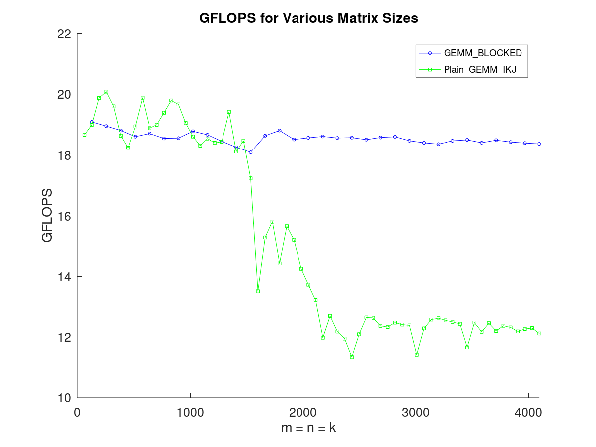

# CS205 C/ C++ Programming-Calculator

**Name**: 吴宇贤

**SID**: 12212614

[toc]

上交文档：mul.c、matrix.c、matrix.h、report.pdf、benchmark.cpp

> 这里cpp文件**仅用于**google benchmark的基准测试，project中所有要求的算法均为**C语言**实现。

编译命令：

```cmd
mul.c:
$ gcc -O3 matrix.c mul.c -lbenchmark -lpthread -lopenblas -mavx -mfma -fopenmp -o matrix.out
benchmark.cpp:
$ g++ -std=c++11 -O3 benchmark.cpp mul.c -lbenchmark -lpthread -lopenblas -mavx -mfma -fopenmp -o benchmark.out
```

## Part 1 - Analysis & Optimize

### 1. 阅读需求

> 1. Only float is needed since it is the most commonly used data type in deep learning.
> 2. Implement a function matmul_plain() in a straightforward way using several loops as the benchmark.
>
> 3. Implement a function matmul_improved() using SIMD, OpenMP and other technologies to improve the speed. You can compare it with matmul_plain().
>
> 4. Test the performance using 16x16, 128x128, 1Kx1K, 8Kx8K and 64Kx64K matrices. You can generate some matrics with random values to test your function.
>
> 5. Compare your implementation with the matrix multiplication in OpenBLAS (https://www.openblas.net/). The results of your implementation should be the same or very similar to those of OpenBLAS. Can your implementation be as fast as OpenBLAS?
>
> 6. [Optional] Test your program on X86 and ARM platforms, and describe the differences.

我们可以很直观地看出，这次project要求我们实现矩阵乘法并且使用各种方法尽可能地进行性能优化。我所了解的矩阵乘法优化方法分为两类：

- 基于算法分析的方法：根据矩阵乘计算特性，从数学角度优化，典型的算法包括 Strassen 算法和 Coppersmith–Winograd 算法。
- 基于软件优化的方法：根据计算机存储系统的层次结构特性，选择性地调整计算顺序，主要有循环拆分向量化、内存重排等。

从project要求我们使用SIMD, OpenMP等技术进行优化并与OpenBLAS比较速度可以看出，这次的优化偏向于后者，也就是在保持复杂度$O(n^3)$不变的情况下进行优化使得计算速度尽可能快。

如何衡量相同复杂度下不同矩阵乘法算法的优异呢，这里我进行性能测试的数据都是在M=N=K的情况下，选取GFLOPS（Giga Floating-point Operations Per Second，每秒十亿次浮点运算）作为评价指标。

GFLOPS，可以衡量CPU的throughput。这是一个衡量计算设备性能的指标，主要用于评估计算机、特别是高性能计算机和图形处理单元（GPU）在处理浮点计算任务时的速度。对于$M*K$的矩阵与$K*N$的矩阵相乘，运行时间为t(s)，其GFLOPS为
$$
GFLOPS = \frac{2mnk}{10^9 *t}
$$
其中，对于运行时间t，使用Google Benchmark测量。题目要求测量 16x16, 128x128, 1Kx1K, 8Kx8K, 64Kx64K的矩阵，对于不同的优化程序以及不同的场景我选取了不同的测量梯度和步长（后续会详细说明）来测量矩阵乘法的耗时，然后使用octave将数据绘制成图。

最后，所有的测试都使用`-O3`参数用来指定编译器进行高级优化，以提升程序的执行效率。这样可以程序在运行时达到更快的速度，而这对于性能测试不可或缺，因为我们希望知道程序在最优化状态下的性能表现，可以更准确地评估程序的性能瓶颈和优化潜力。

### 2. 优化

对于优化的方法，在看完文档后就有一些思路，我初步想到了以下几种方法

1. 循环重排
2. 数据分块
4. 向量指令集
6. 多线程

#### 2.1 暴力

##### 2.1.1 原始算法

最原始矩阵乘法算法就是模拟两个矩阵计算的过程。

对于矩阵$m*n$的矩阵A、$n*p$的矩阵B，两矩阵相乘得$m*p$的矩阵C，其中矩阵C的每个元素满足
$$
C{ij}=\sum^n_{k=1}a_{ik}*b_{kj}
$$
从而代码层面的实现较为简单

```c
// mul.c

void plain_gemm_ijk(const size_t N, const size_t M, const size_t K, const float *mat1, const float *mat2, float *mat)
{
    if (mat1 == NULL || mat2 == NULL || mat == NULL)
        return;

    for (size_t i = 0; i < N; i++)
        for (size_t j = 0; j < M; j++)
            for (size_t k = 0; k < K; k++)
                mat[i * M + j] += mat1[i * K + k] * mat2[k * M + j];
}
```

> 在测量朴素暴力算法的时候，数据量>1000时的测量时间就已经比较困难，而且重点不在此，故选取了[16,1024]区间，以16为步长进行测量

最后测出来的结果是：


##### 2.1.2 改变循环顺序

上面的原始算法循环顺序是ijk，那么很容易想到循环顺序还有ikj、jik、jki、kij、kji五种，于是我对这五种顺序依次进行了测量并统计数据后绘图。结果如下：


可以发现，仅仅改变了循环顺序，就导致GFLOPS有数倍的差异，其中IKJ和KIJ的表现最为亮眼且IKJ险胜，随后把最快IKJ和最朴素的算法IJK拿出来对比。

我们更加直观的发现IKJ的循环顺序领先IJK一大截，这是为什么呢？

我们知道，计算机CPU旁边是有缓存(Cache)存储介质，CPU每次从主内存(memory)读写数据的时候都会去看cache中是否已经有该数据，如果有就会直接从cache读写，因为Cache的速度远大于memory的速度，所以cache能大大提高数据读写效率。

- 如果CPU要读写的数据在Cache中不存在，那么就必须去下一级缓存或者主内存去读写，此时读写效率很低，这叫**缓存未命中。**
- 如果CPU要读写的数据在Cache中存在，那么就直接从cache中读写，读写效率大大提高，这叫**缓存命中**。

而这里对于矩阵数据的存储是采取**行优先存储原则**，如下图：


IJK算法和IKJ算法性能差异巨大的原因在于前者在计算时发生了大量的**cache miss**：在 𝐴 相应行中不断向右移动时，内存访问是连续的；但 𝐵 相应列不断向下移动时，内存访问是不连续的


而后者的循环顺序能够在原始算法的基础上保证尽可能多的**cache hit**


但即便IKJ算法相较于最朴素算法以及提升数倍，但和OpenBlas相比真是相形见绌：


OpenBlas的GFLOPS甚至可以达到IKJ算法的十多倍，由此可见优化远远不足。

#### 2.2 分块

虽然说IKJ的循环顺序能够在原始算法的基础上保证尽可能多的**cache hit**，但是缓存的大小是有限的，所以随着数据量的增加，cache miss的情况还是会发生，所以我们接下来的优化就是想办法减少cache miss。而减少cache miss最有效的方法就是分块，然后将分块之后的数据保存在 CPU 的 Cache 中。

现在的目标是把矩阵分成小块后，让小块尽可能塞满Cache。但是呢，这里的塞满其实是有讲究的。

首先我们要弄清楚CPU 的 Cache 结构特点：


通俗一点来说，速度L1D>L2>L3，容量 L1D<L2<L3

对于分块的矩阵乘法：


为了使得Cache miss 率尽量低，理论上来说分配要尽量合理：

- 将上图中红色 (访问重复次数最多的 A 的行块，计算时需要的 B 的一个列块以及计算结果的 C 的小块) 部分都保存在 L1 中。
- 由于计算完每一个 C 的行块，都需要重复遍历一次整个 B 矩阵，因此将 B 存放在 L2 中使得每次读取 B 的一个列块都是从 L2 中读取，代价最小。

所以从理论上来说，只要我们知道了缓存的大小，通过纯计算就可以得到最合适的块大小，但是由于运行环境比较复杂（所有测试均在统一复杂环境），我还是选择不断测量获得最佳块大小。代码如下：

```c
// mul.c

void plain_gemm_blocked(const size_t M, const size_t N, const size_t K, const float *mat1, const float *mat2, float *mat)
{
    if (mat1 == NULL || mat2 == NULL || mat == NULL)
        return;

    const size_t MBlockSize = 128;
    const size_t KBlockSize = 8;
    const size_t NBlockSize = 128;
    for (size_t i = 0; i < M; i += MBlockSize)
        for (size_t k = 0; k < K; k += KBlockSize)
            for (size_t j = 0; j < N; j += NBlockSize)
                for (size_t ii = i; ii < i + MBlockSize; ii++)
                    for (size_t kk = k; kk < k + KBlockSize; kk++)
                        for (size_t jj = j; jj < j + NBlockSize; jj++)
                            mat[ii * N + jj] += mat1[ii * K + kk] * mat2[kk * N + jj];
}
```

也就是说，A每次访问MBlockSize x KBlockSize的块，B每次访问KBlockSize x NBlockSize的块。其中MBlockSize、KBlockSize和NBlockSize的大小进行多次尝试决定。

> 选择区间[128, 4096]，步长128进行测试，其中单组运行时间超过10s则自动停止。

以下是测试结果：


我们发现当$$MBlockSize=NBlockSize=128$$的时候GFLOPS比较大且稳定，最终选择了$$MBlockSize=KBlockSize=NBlockSize=128$$作为块大小。

然后把这种分块和IKJ暴力算法拎出来对比一下：



发现了两个有意思的现象：

- 数据量较小的时候，分块的方法平均GFLOPS还不如暴力IKJ顺序算法
- 随着数据量增大，暴力IKJ顺序算法在某个节点之后GFLOPS急剧下降（之前暴力测试时数据量太小没发现）

仔细思考之后，还是和缓存有关。我的电脑缓存配置如下：

```
L1 Data 32 KiB (x8)
L1 Instruction 32 KiB (x8)
L2 Unified 512 KiB (x8)
L3 Unified 16384 KiB (x1)
```

对于第一个现象，数据量较小的时候，缓存塞得下整个矩阵，这时分块反而是多余的操作，会造成更多的cache miss；对于第二个现象在$$m=n=k=1250$$左右的地方开始急剧下降，我们简单计算一下：
$$
1300*1300*4(float字节数)/1024 = 6601.5625 KiB
$$
而缓存大小
$$
32+512+16384 = 16928 KiB ≈6601*3
$$


所以可以简单推到，从这里开始数据塞满了缓存，于是数据量继续增加导致缓存不够用，造成了更多的cache miss，而分块算法不下降是因为后续无论矩阵多大，块大小是不变的。

#### 2.3 重排

那我们怎么才能让分块收益更高呢，分块算法在计算过程中，需要同时读取 A 矩阵 MBlockSize行数据，而每行数据之间内存不连续，因此这种访问对 Cache 不友好，同样，在读取矩阵 B 中 NBlockSize列的时候也存在数据读取不连续的问题，加之 A 的所有行块和 B 中的所有列块将被读取多次，因此可以通过对 A 和 B 提前进行数据 PACK， 实现在后续计算中频繁多次访问数据时是连续的（只在第一次 PACK 时对 Cache 不友好），进而获得巨大收益。


```c
// mul.c

void gemm_blocked_packed(const size_t M, const size_t N, const size_t K, const float *mat1, const float *mat2, float *mat)
{
    if (mat1 == NULL || mat2 == NULL || mat == NULL)
        return;

    const size_t MBlockSize = 128;
    const size_t KBlockSize = 128;
    const size_t NBlockSize = 128;

    float *packed_mat1 = (float *)aligned_alloc(1024, MBlockSize * KBlockSize * sizeof(float));
    float *packed_mat2 = (float *)aligned_alloc(1024, KBlockSize * NBlockSize * sizeof(float));

    for (size_t i = 0; i < M; i += MBlockSize)
    {
        for (size_t k = 0; k < K; k += KBlockSize)
        {
            // Pack mat1's current block
            for (size_t ii = i, p1_idx = 0; ii < i + MBlockSize; ++ii)
                for (size_t kk = k; kk < k + KBlockSize; ++kk)
                    packed_mat1[p1_idx++] = mat1[ii * K + kk];

            for (size_t j = 0; j < N; j += NBlockSize)
            {
                // Pack mat2's current block
                for (size_t kk = k, p2_idx = 0; kk < k + KBlockSize; ++kk)
                    for (size_t jj = j; jj < j + NBlockSize; ++jj)
                        packed_mat2[p2_idx++] = mat2[kk * N + jj];

                // Compute block product
                for (size_t ii = 0; ii < MBlockSize; ++ii)
                    for (size_t kk = 0; kk < KBlockSize; ++kk)
                        for (size_t jj = 0; jj < NBlockSize; ++jj)
                            mat[(i + ii) * N + j + jj] += 
                            	packed_mat1[ii * KBlockSize + kk] * packed_mat2[kk * NBlockSize + jj];
            }
        }
    }

    free(packed_mat1);
    free(packed_mat2);
}
```

测试结果：


可以发现，重排矩阵后，GFLOPS确实有很大的提升，而且此时暴力IKJ算法也不会在任何时候比分块+重排后的矩阵乘法更加高效。

#### 2.4 向量化

前段时间学习了SIMD（Single Instruction Multiple Data，单指令多数据流）这种实现空间上的并行性的技术，而这种技术使用一个控制器控制多个处理单元，同时对一组数据中的每一个数据执行相同的操作。在 SIMD 指令执行期间，任意时刻都只有一个进程在运行，即 SIMD 没有并发性，仅仅只是同时进行计算，所以不算多线程。

而这里我选择的是AVX2指令集，它的浮点运算命令扩展到了 256 位，同时支持 FMA（Fused Multiply-Accumulate，融合乘法累加）运算，可以在提高运算效率的同时减少运算时的精度损失，这不是刚刚好给我们矩阵乘法的优化指了一条明路吗。

在分块+重排的基础上，把最内层的连续的多个乘法计算用一个向量乘法完成：

```c
// mul.c
// gemm_blocked_packed_avx
for (size_t ii = 0; ii < MBlockSize; ii++)
{
    for (size_t kk = 0; kk < KBlockSize; kk++)
        for (size_t jj = 0; jj < NBlockSize; jj += 8)
        {
            __m256 sum = _mm256_load_ps(&mat[(i + ii) * N + j + jj]);
            __m256 a = _mm256_broadcast_ss(&packed_mat1[ii * KBlockSize + kk]);
            __m256 b = _mm256_load_ps(&packed_mat2[kk * NBlockSize + jj]);
            sum = _mm256_fmadd_ps(a, b, sum);
            _mm256_store_ps(&mat[(i + ii) * N + j + jj], sum);
        }
}
```

效果如下：


但是我查阅avx2指令集(电脑不支持avx256)后发现，其实单纯这样修改并没有把向量化用到极致，因为avx2指令集有16个YMM 寄存器（每个寄存器可以存储 8 个单精度浮点数），为了让这些寄存器没有一个漏网之鱼，我将使用了avx2指令集的代码调整为如下所示：

```c
// mul.c
// gemm_blocked_packed_avx_2
for (size_t ii = 0; ii < MBlockSize; ii++)
{
    for (size_t jj = 0; jj < NBlockSize; jj += 64)
    {
        __m256 sum0 = _mm256_load_ps(&mat[(i + ii) * N + j + jj]);
        __m256 sum1 = _mm256_load_ps(&mat[(i + ii) * N + j + jj + 8]);
        __m256 sum2 = _mm256_load_ps(&mat[(i + ii) * N + j + jj + 16]);
        __m256 sum3 = _mm256_load_ps(&mat[(i + ii) * N + j + jj + 24]);
        __m256 sum4 = _mm256_load_ps(&mat[(i + ii) * N + j + jj + 32]);
        __m256 sum5 = _mm256_load_ps(&mat[(i + ii) * N + j + jj + 40]);
        __m256 sum6 = _mm256_load_ps(&mat[(i + ii) * N + j + jj + 48]);
        __m256 sum7 = _mm256_load_ps(&mat[(i + ii) * N + j + jj + 56]);
        for (size_t kk = 0; kk < KBlockSize; kk++)
        {
            __m256 a = _mm256_broadcast_ss(&packed_mat1[ii * KBlockSize + kk]);

            __m256 b0 = _mm256_load_ps(&packed_mat2[kk * NBlockSize + jj]);
            __m256 b1 = _mm256_load_ps(&packed_mat2[kk * NBlockSize + jj + 8]);
            __m256 b2 = _mm256_load_ps(&packed_mat2[kk * NBlockSize + jj + 16]);
            __m256 b3 = _mm256_load_ps(&packed_mat2[kk * NBlockSize + jj + 24]);
            __m256 b4 = _mm256_load_ps(&packed_mat2[kk * NBlockSize + jj + 32]);
            __m256 b5 = _mm256_load_ps(&packed_mat2[kk * NBlockSize + jj + 40]);
            __m256 b6 = _mm256_load_ps(&packed_mat2[kk * NBlockSize + jj + 48]);
            __m256 b7 = _mm256_load_ps(&packed_mat2[kk * NBlockSize + jj + 56]);

            sum0 = _mm256_fmadd_ps(a, b0, sum0);
            sum1 = _mm256_fmadd_ps(a, b1, sum1);
            sum2 = _mm256_fmadd_ps(a, b2, sum2);
            sum3 = _mm256_fmadd_ps(a, b3, sum3);
            sum4 = _mm256_fmadd_ps(a, b4, sum4);
            sum5 = _mm256_fmadd_ps(a, b5, sum5);
            sum6 = _mm256_fmadd_ps(a, b6, sum6);
            sum7 = _mm256_fmadd_ps(a, b7, sum7);
        }
        _mm256_store_ps(&mat[(i + ii) * N + j + jj], sum0);
        _mm256_store_ps(&mat[(i + ii) * N + j + jj + 8], sum1);
        _mm256_store_ps(&mat[(i + ii) * N + j + jj + 16], sum2);
        _mm256_store_ps(&mat[(i + ii) * N + j + jj + 24], sum3);
        _mm256_store_ps(&mat[(i + ii) * N + j + jj + 32], sum4);
        _mm256_store_ps(&mat[(i + ii) * N + j + jj + 40], sum5);
        _mm256_store_ps(&mat[(i + ii) * N + j + jj + 48], sum6);
        _mm256_store_ps(&mat[(i + ii) * N + j + jj + 56], sum7);
    }
}
```

这样写的代码尽可能使得程序在单线程的情况下更多的"并发"计算，肯定能提高效率。测试结果如下：


果不其然，相较于只使用一次向量计算，我们把能够用的寄存器用到极致时，GFLOPS有很明显的提升；更值得一提的是，相较于仅仅重排矩阵，好好利用向量化之后，GFLOPS提高了接近一倍！

#### 2.5 多线程

我的打算是对原始IKJ暴力算法、分块、分块+重排、以及向量化方法分别使用OpenMP进行多线程处理，随后测试并且放到一起对比，而前面提过极致的向量化方法严格来说不算多线程，而多核CPU的每个核都有自己的寄存器和ALU运算单元，所以从理论上来说，在多线程的情况下，他的性能应该会更加爆炸。

源码基本没有变化，仅仅添加了几行OpenMP的代码，如下：

```c
void gemm_ikj_OpenMP(const size_t M, const size_t N, const size_t K, const float *mat1, const float *mat2, float *mat)
{
    if (mat1 == NULL || mat2 == NULL || mat == NULL)
        return;
#pragma omp parallel for
    for (size_t i = 0; i < M; i++)
        for (size_t k = 0; k < K; k++)
            for (size_t j = 0; j < N; j++)
                mat[i * N + j] += mat1[i * K + k] * mat2[k * N + j];
}

void gemm_blocked_OpenMP(const size_t M, const size_t N, const size_t K, const float *mat1, const float *mat2, float *mat)
{
    if (mat1 == NULL || mat2 == NULL || mat == NULL)
        return;

    const size_t MBlockSize = M < 128 ? M : 128;
    const size_t KBlockSize = K < 128 ? K : 128;
    const size_t NBlockSize = N < 128 ? N : 128;
#pragma omp parallel for collapse(3)
    for (size_t i = 0; i < M; i += MBlockSize)
        for (size_t k = 0; k < K; k += KBlockSize)
            for (size_t j = 0; j < N; j += NBlockSize)
                for (size_t ii = i; ii < i + MBlockSize; ii++)
                    for (size_t kk = k; kk < k + KBlockSize; kk++)
                        for (size_t jj = j; jj < j + NBlockSize; jj++)
                            mat[ii * N + jj] += mat1[ii * K + kk] * mat2[kk * N + jj];
}

后续为
#pragma omp parallel{
    #pragma omp for collapse(3)
}
#pragma omp parallel{
	#pragma omp for collapse(2) schedule(dynamic)
}
详见后面的源代码
```

结果如下图所示：(包括OpenBLAS)


没有使用多线程之前这几种方法的效率都是稳步提高的，所以预期之中使用多线程之后这些方法的优异顺序应该不会变，果然结果和预期一致。这几种方法GFLOPS稳步提高，甚至gemm_blocked_packed_avx_2算法，也就是分块+重排+向量化以及将avx2指令集的FMM寄存器用到极致后，再加之多线程，测出来的GFLOPS竟然比OpenBLAS提供的算法还要高，我一度以为是因为OpenMP的原因使得算法出了问题，于是赶紧写了一个脚本和朴素暴力算法对拍，结果显示多线程下的该方法没有任何问题，虚惊一场！

## Part 2 - Result

将单线程和多线程效率最高的算法分别和OpenBLAS对比如下：


各优化后的算法执行时间：

|              M=K=N               |   16    |    128    |     1024     |     8192      |
| :------------------------------: | :-----: | :-------: | :----------: | :-----------: |
|           gemm_blocked           | 1048 ns | 219755 ns | 120155927 ns | 6.0704e+10 ns |
|       gemm_blocked_packed        | 1158 ns | 165535 ns | 85428437 ns  | 5.9290e+10 ns |
|    gemm_blocked_packed_avx_1     | 676 ns  | 106379 ns | 55615289 ns  | 2.9751e+10 ns |
|    gemm_blocked_packed_avx_2     |         | 80685 ns  | 44236083 ns  | 2.3138e+10 ns |
|         gemm_ikj_OpenMP          | 1623 ns | 44231 ns  | 19806966 ns  | 4.8383e+10 ns |
|       gemm_blocked_OpenMP        | 6046 ns | 343027 ns | 20479403 ns  | 8787485039 ns |
|    gemm_blocked_packed_OpenMP    | 4528 ns | 256507 ns | 17945381 ns  | 6552516551 ns |
| gemm_blocked_packed_avx_1_OpenMP | 3029 ns | 162191 ns | 17505936 ns  | 4965954720 ns |
| gemm_blocked_packed_avx_2_OpenMP |         | 146901 ns |  7203051 ns  | 3690595130 ns |
|            gemm_cblas            | 562 ns  | 45320 ns  |  8605207 ns  | 4150837604 ns |

相应的GFLOPS：

|              M=K=N               |    16     |    128    |    1024    |    8192    |
| :------------------------------: | :-------: | :-------: | :--------: | :--------: |
|           gemm_blocked           | 7.816794  | 19.086273 | 17.972474  | 18.112672  |
|       gemm_blocked_packed        | 7.074266  | 25.337868 | 25.137808  | 18.544639  |
|    gemm_blocked_packed_avx_1     | 12.118343 | 39.427932 | 38.613189  | 36.957132  |
|    gemm_blocked_packed_avx_2     |           | 51.983690 | 48.545972  | 47.519735  |
|         gemm_ikj_OpenMP          | 5.047443  | 94.827247 | 108.420628 | 22.725164  |
|       gemm_blocked_OpenMP        | 1.354945  | 12.227329 | 104.860656 | 125.122447 |
|    gemm_blocked_packed_OpenMP    | 1.809187  | 16.351616 | 119.667766 | 167.799901 |
| gemm_blocked_packed_avx_1_OpenMP | 2.704523  | 25.860276 | 122.671741 | 221.409918 |
| gemm_blocked_packed_avx_2_OpenMP |           | 28.551909 | 298.135282 | 297.922581 |
|            gemm_cblas            | 14.576512 | 92.548632 | 249.556303 | 264.889098 |

其实结合这里的数据和上一部分的图不难发现，多线程在小数据量的时候可能还不如单线程，因为单线程很快做完的事情，多线程恐怕还在"分工"，同样，小数据量的时候OpenBLAS也是遥遥领先，这就是算法内有线程管理的好处，可以根据需求设置线程数。

## Part 3 - Difficulties & Solutions

1. 此前只知道缓存、内存的概念，但从来没有想过要把缓存和内存的理论知识真正写进代码中，最多也就是了解二维数组两种不同的访问顺序会导致不同的效率，但是仔细想想，矩阵也可以说是二维数组，所谓不同的访问顺序，其实也就是这个project最开始的循环重排。除了这一点之外也从来没想过缓存竟然能做这么大的文章。可以说这次project主要的目标就是围绕着缓存，越多的Cache hit就越接近胜利。
2. 使用向量化方法优化算法的时候，AVX2指令集的``_mm256_load_ps``指令可算是把我折磨惨了，一开始总是报``segmentation fault``，一开始一直找不到问题，后面用输出语句一步一步找到出错的语句，没错，就是这个``_mm256_load_ps``指令，原来它是要求对齐的，然后把所有的代码分配内存都改为了``aligned_alloc``。
3. 在project前期其实比较沮丧，因为一写完暴力算法就拿出了OpenBLAS中的矩阵乘法算法，两者一比，简直天上地下，但是考虑到这是暴力算法也没什么，但是随着继续优化，我发现事情不太对，从GFLOPS一开始的十几到后来的几十，距离OpenBLAS的200+遥遥无期，所以一度没有什么动力，但所幸坚持下来，知道测试多线程的时候，我才意识到，OpenBLAS内部应该是做了良好的线程管理的，调用矩阵乘法算法的同时，会根据实际情况管理线程，当然，必须承认的是这是我这次project没有考虑到的点，按理说前面的单线程就应该和OpenBLAS的单线程对比，我相信这种开源的代码肯定有地方可以设置参数以达到单线程的目的。

## Part 4 - Conclusion

在这个project中，通过深入的探究和实践，我从最初的基本暴力算法到使用各种优化技术，包括循环重排、数据分块、矩阵重排、向量化以及多线程技术，每一步优化都大幅提高了计算效率，并且我在这个过程中了解了多种算法和编程技术以及一些电脑的结构。而这些面向缓存的利用和数据组织方式方面的优化，相信会让我在以后的编程中更加重视底层逻辑和问题。

最后就是关于多线程+前面一系列优化效率超过了OpenBLAS的这件事情还是让我比较满意的。

## Part 5 - Source Code

matrix.h：

```c
// matrix.h
#ifndef _MATRIX_H_
#define _MATRIX_H_

#include <stddef.h>

typedef struct
{
    size_t rows;
    size_t cols;
    float *data;
} Matrix;

Matrix *matmul_plain(const Matrix *MatA, const Matrix *MatB);
Matrix *matmul_improved(const Matrix *MatA, const Matrix *MatB);

void plain_gemm_ijk(const size_t N, const size_t M, const size_t K, const float *mat1, const float *mat2, float *mat);
void plain_gemm_ikj(const size_t N, const size_t M, const size_t K, const float *mat1, const float *mat2, float *mat);
void plain_gemm_kij(const size_t N, const size_t M, const size_t K, const float *mat1, const float *mat2, float *mat);
void plain_gemm_jik(const size_t N, const size_t M, const size_t K, const float *mat1, const float *mat2, float *mat);
void plain_gemm_kji(const size_t N, const size_t M, const size_t K, const float *mat1, const float *mat2, float *mat);
void plain_gemm_jki(const size_t N, const size_t M, const size_t K, const float *mat1, const float *mat2, float *mat);
void gemm_blocked(const size_t N, const size_t M, const size_t K, const float *mat1, const float *mat2, float *mat);
void gemm_blocked_packed(const size_t M, const size_t N, const size_t K, const float *mat1, const float *mat2, float *mat);
void gemm_blocked_packed_writecache(const size_t M, const size_t N, const size_t K, const float *mat1, const float *mat2, float *mat);
void gemm_blocked_packed_avx_1(const size_t M, const size_t N, const size_t K, const float *mat1, const float *mat2, float *mat);
void gemm_blocked_packed_avx_2(const size_t M, const size_t N, const size_t K, const float *mat1, const float *mat2, float *mat);
void gemm_ikj_OpenMP(const size_t M, const size_t N, const size_t K, const float *mat1, const float *mat2, float *mat);
void gemm_blocked_OpenMP(const size_t N, const size_t M, const size_t K, const float *mat1, const float *mat2, float *mat);
void gemm_blocked_packed_OpenMP(const size_t M, const size_t N, const size_t K, const float *mat1, const float *mat2, float *mat);
void gemm_blocked_packed_avx_1_OpenMP(const size_t M, const size_t N, const size_t K, const float *mat1, const float *mat2, float *mat);
void gemm_blocked_packed_avx_2_OpenMP(const size_t M, const size_t N, const size_t K, const float *mat1, const float *mat2, float *mat);

void gemm_cblas(const size_t N, const size_t M, const size_t K, const float *mat1, const float *mat2, float *mat);

#endif
```

matrix.c：

```c
// matrix.c
#include "matrix.h"

#include <stdlib.h>
#include <stdio.h>

Matrix *MatrixConstructor(size_t rows, size_t cols)
{
    // 分配Matrix结构体的内存
    Matrix *matrix = (Matrix *)malloc(sizeof(Matrix));
    if (matrix == NULL)
    {
        fprintf(stderr, "Memory allocation failed for Matrix struct.\n");
        return NULL; // 如果内存分配失败，则返回NULL
    }

    // 初始化行和列
    matrix->rows = rows;
    matrix->cols = cols;

    // 为矩阵数据分配内存
    matrix->data = (float *)aligned_alloc(1024, rows * cols * sizeof(float));
    if (matrix->data == NULL)
    {
        fprintf(stderr, "Memory allocation failed for Matrix data.\n");
        free(matrix); // 如果数据分配失败，释放已分配的结构体内存
        return NULL;
    }

    // 初始化矩阵数据为0
    for (size_t i = 0; i < rows * cols; i++)
    {
        matrix->data[i] = 0.0f;
    }

    return matrix; // 返回指向新分配和初始化的Matrix结构体的指针
}

void MatrixDestructor(Matrix *matrix)
{
    if (matrix != NULL)
    {
        free(matrix->data); // 释放矩阵数据内存
        free(matrix);       // 释放Matrix结构体内存
    }
}

void MatrixRandomize(Matrix *matrix)
{
    if (matrix == NULL || matrix->data == NULL)
    {
        fprintf(stderr, "Input matrices cannot be NULL.\n");
        return; // 检查矩阵指针和数据指针是否为NULL
    }

    // srand(time(NULL)); // 使用当前时间作为随机种子

    size_t size = matrix->rows * matrix->cols;
    for (size_t i = 0; i < size; i++)
    {
        matrix->data[i] = (float)(rand() / RAND_MAX * 10.0f); // 生成0到10之间的随机浮点数
    }
}

Matrix *matmul_plain(const Matrix *MatA, const Matrix *MatB)
{
    // 检查输入矩阵是否为NULL
    if (MatA == NULL || MatB == NULL || MatA->data == NULL || MatB->data == NULL)
    {
        fprintf(stderr, "Input matrices cannot be NULL.\n");
        return NULL;
    }

    // 检查矩阵的尺寸是否匹配
    if (MatA->cols != MatB->rows)
    {
        fprintf(stderr, "Matrix dimensions do not match for multiplication.\n");
        return NULL;
    }

    // 创建结果矩阵
    Matrix *MatC = MatrixConstructor(MatA->rows, MatB->cols);
    if (!MatC)
    {
        fprintf(stderr, "Memory allocation failed for result matrix.\n");
        return NULL;
    }

    // 计算矩阵乘法
    plain_gemm_ikj(MatA->rows, MatB->cols, MatA->cols, MatA->data, MatB->data, MatC->data);


    // 返回计算后的结果矩阵
    return MatC;
}

Matrix *matmul_improved(const Matrix *MatA, const Matrix *MatB)
{
    // 检查输入矩阵是否为NULL
    if (MatA == NULL || MatB == NULL || MatA->data == NULL || MatB->data == NULL)
    {
        fprintf(stderr, "Input matrices cannot be NULL.\n");
        return NULL;
    }

    // 检查矩阵的尺寸是否匹配
    if (MatA->cols != MatB->rows)
    {
        fprintf(stderr, "Matrix dimensions do not match for multiplication.\n");
        return NULL;
    }

    // 创建结果矩阵
    Matrix *MatC = MatrixConstructor(MatA->rows, MatB->cols);
    if (!MatC)
    {
        fprintf(stderr, "Memory allocation failed for result matrix.\n");
        return NULL;
    }

    // 计算矩阵乘法
    gemm_blocked_packed_avx_2_OpenMP(MatA->rows, MatB->cols, MatA->cols, MatA->data, MatB->data, MatC->data);

    // 返回计算后的结果矩阵
    return MatC;
}


int main()
{
    // 创建两个矩阵
    Matrix *A = MatrixConstructor(1024, 512);
    Matrix *B = MatrixConstructor(512, 1024);

    // 随机初始化矩阵数据
    MatrixRandomize(A);
    MatrixRandomize(B);

    // 比较两种矩阵乘法的结果，若不同输出-1
    Matrix *C = matmul_improved(A, B);
    Matrix *D = matmul_plain(A, B);

    // 输出结果
    for (size_t i = 0; i < C->rows * C->cols; i++)
    {
        if (C->data[i] != D->data[i])
        {
            printf("-1\n");
            break;
        }
    }

    printf("Test Passed\n");

    // 释放矩阵内存
    MatrixDestructor(A);
    MatrixDestructor(B);
    MatrixDestructor(C);
    MatrixDestructor(D);

    return 0;
}
```

mul.c：

```c
#include "matrix.h"
#include <cblas.h>
#include <string.h>
#include <immintrin.h> // AVX2
#include <omp.h> 

void plain_gemm_ijk(const size_t M, const size_t N, const size_t K, const float *mat1, const float *mat2, float *mat)
{
    if (mat1 == NULL || mat2 == NULL || mat == NULL)
        return;

    for (size_t i = 0; i < M; i++)
        for (size_t j = 0; j < N; j++)
            for (size_t k = 0; k < K; k++)
                mat[i * N + j] += mat1[i * K + k] * mat2[k * N + j];
}

void plain_gemm_ikj(const size_t M, const size_t N, const size_t K, const float *mat1, const float *mat2, float *mat)
{
    if (mat1 == NULL || mat2 == NULL || mat == NULL)
        return;

    for (size_t i = 0; i < M; i++)
        for (size_t k = 0; k < K; k++)
            for (size_t j = 0; j < N; j++)
                mat[i * N + j] += mat1[i * K + k] * mat2[k * N + j];
}

void plain_gemm_kij(const size_t M, const size_t N, const size_t K, const float *mat1, const float *mat2, float *mat)
{
    if (mat1 == NULL || mat2 == NULL || mat == NULL)
        return;

    for (size_t k = 0; k < K; k++)
        for (size_t i = 0; i < M; i++)
            for (size_t j = 0; j < N; j++)
                mat[i * N + j] += mat1[i * K + k] * mat2[k * N + j];
}

void plain_gemm_jik(const size_t M, const size_t N, const size_t K, const float *mat1, const float *mat2, float *mat)
{
    if (mat1 == NULL || mat2 == NULL || mat == NULL)
        return;

    for (size_t j = 0; j < N; j++)
        for (size_t i = 0; i < M; i++)
            for (size_t k = 0; k < K; k++)
                mat[i * N + j] += mat1[i * K + k] * mat2[k * N + j];
}

void plain_gemm_kji(const size_t M, const size_t N, const size_t K, const float *mat1, const float *mat2, float *mat)
{
    if (mat1 == NULL || mat2 == NULL || mat == NULL)
        return;

    for (size_t k = 0; k < K; k++)
        for (size_t j = 0; j < N; j++)
            for (size_t i = 0; i < M; i++)
                mat[i * N + j] += mat1[i * K + k] * mat2[k * N + j];
}

void plain_gemm_jki(const size_t M, const size_t N, const size_t K, const float *mat1, const float *mat2, float *mat)
{
    if (mat1 == NULL || mat2 == NULL || mat == NULL)
        return;

    for (size_t j = 0; j < N; j++)
        for (size_t k = 0; k < K; k++)
            for (size_t i = 0; i < M; i++)
                mat[i * N + j] += mat1[i * K + k] * mat2[k * N + j];
}

// 分块
void gemm_blocked(const size_t M, const size_t N, const size_t K, const float *mat1, const float *mat2, float *mat)
{
    if (mat1 == NULL || mat2 == NULL || mat == NULL)
        return;

    const size_t MBlockSize = 128;
    const size_t KBlockSize = 128;
    const size_t NBlockSize = 128;
    for (size_t i = 0; i < M; i += MBlockSize)
        for (size_t k = 0; k < K; k += KBlockSize)
            for (size_t j = 0; j < N; j += NBlockSize)
                for (size_t ii = i; ii < i + MBlockSize; ii++)
                    for (size_t kk = k; kk < k + KBlockSize; kk++)
                        for (size_t jj = j; jj < j + NBlockSize; jj++)
                            mat[ii * N + jj] += mat1[ii * K + kk] * mat2[kk * N + jj];
}

// 分块 + 重排
void gemm_blocked_packed(const size_t M, const size_t N, const size_t K, const float *mat1, const float *mat2, float *mat)
{
    if (mat1 == NULL || mat2 == NULL || mat == NULL)
        return;

    const size_t MBlockSize = 128;
    const size_t KBlockSize = 128;
    const size_t NBlockSize = 128;

    float *packed_mat1 = (float *)aligned_alloc(1024, MBlockSize * KBlockSize * sizeof(float));
    float *packed_mat2 = (float *)aligned_alloc(1024, KBlockSize * NBlockSize * sizeof(float));

    for (size_t i = 0; i < M; i += MBlockSize)
    {
        for (size_t k = 0; k < K; k += KBlockSize)
        {
            // Pack mat1's current block
            for (size_t ii = i, p1_idx = 0; ii < i + MBlockSize; ++ii)
                for (size_t kk = k; kk < k + KBlockSize; ++kk)
                    packed_mat1[p1_idx++] = mat1[ii * K + kk];

            for (size_t j = 0; j < N; j += NBlockSize)
            {
                // Pack mat2's current block
                for (size_t kk = k, p2_idx = 0; kk < k + KBlockSize; ++kk)
                    for (size_t jj = j; jj < j + NBlockSize; ++jj)
                        packed_mat2[p2_idx++] = mat2[kk * N + jj];

                // Compute block product
                for (size_t ii = 0; ii < MBlockSize; ++ii)
                    for (size_t kk = 0; kk < KBlockSize; ++kk)
                        for (size_t jj = 0; jj < NBlockSize; ++jj)
                            mat[(i + ii) * N + j + jj] += packed_mat1[ii * KBlockSize + kk] * packed_mat2[kk * NBlockSize + jj];
            }
        }
    }

    free(packed_mat1);
    free(packed_mat2);
}

// 分块 + 重排 + 写缓存优化(没啥用)
void gemm_blocked_packed_writecache(const size_t M, const size_t N, const size_t K, const float *mat1, const float *mat2, float *mat)
{
    if (mat1 == NULL || mat2 == NULL || mat == NULL)
    {
        printf("One or more input pointers are NULL.\n");
        return;
    }

    const size_t MBlockSize = 128;
    const size_t KBlockSize = 128;
    const size_t NBlockSize = 128;

    float *packed_mat1 = (float *)aligned_alloc(1024, MBlockSize * KBlockSize * sizeof(float));
    float *packed_mat2 = (float *)aligned_alloc(1024, KBlockSize * NBlockSize * sizeof(float));

    float *write_cache = (float *)aligned_alloc(1024, M * N * sizeof(float));
    if (packed_mat1 == NULL || packed_mat2 == NULL || write_cache == NULL)
    {
        printf("Memory allocation failed.\n");
        free(packed_mat1);
        free(packed_mat2);
        free(write_cache);
        return;
    }
    memset(write_cache, 0, M * N * sizeof(float));
    for (size_t i = 0; i < M; i += MBlockSize)
    {
        for (size_t k = 0; k < K; k += KBlockSize)
        {
            // Pack mat1's current block
            for (size_t ii = i, p1_idx = 0; ii < i + MBlockSize; ++ii)
                for (size_t kk = k; kk < k + KBlockSize; ++kk)
                    packed_mat1[p1_idx++] = mat1[ii * K + kk];

            for (size_t j = 0; j < N; j += NBlockSize)
            {
                // Pack mat2's current block
                for (size_t kk = k, p2_idx = 0; kk < k + KBlockSize; ++kk)
                    for (size_t jj = j; jj < j + NBlockSize; ++jj)
                        packed_mat2[p2_idx++] = mat2[kk * N + jj];

                float *ptr = write_cache + (MBlockSize * NBlockSize) * ((i / MBlockSize) * (N / NBlockSize) + (j / NBlockSize));
                // Compute block product
                for (size_t ii = 0; ii < MBlockSize; ++ii)
                    for (size_t jj = 0; jj < NBlockSize; ++jj)
                    {
                        float x = 0.0;
                        for (size_t kk = 0; kk < KBlockSize; ++kk)
                            x += packed_mat1[ii * KBlockSize + kk] * packed_mat2[kk * NBlockSize + jj];
                        *ptr++ += x;
                    }
            }
        }
    }

    for (size_t i = 0; i < M * N; i++)
    {
        int block = i / (MBlockSize * NBlockSize);
        int numInBlock = i % (MBlockSize * NBlockSize);

        int row = block / (N / NBlockSize) * MBlockSize;
        int col = block % (N / NBlockSize) * NBlockSize;

        mat[(row + numInBlock / NBlockSize) * N + (col + numInBlock % NBlockSize)] = write_cache[i];
    }

    free(packed_mat1);
    free(packed_mat2);
    free(write_cache);
}

// 分块 + 重排 + AVX
void gemm_blocked_packed_avx_1(const size_t M, const size_t N, const size_t K, const float *mat1, const float *mat2, float *mat)
{
    if (mat1 == NULL || mat2 == NULL || mat == NULL)
        return;

    const size_t MBlockSize = 128;
    const size_t KBlockSize = 128;
    const size_t NBlockSize = 128;

    float *packed_mat1 = (float *)aligned_alloc(1024, MBlockSize * KBlockSize * sizeof(float));
    float *packed_mat2 = (float *)aligned_alloc(1024, KBlockSize * NBlockSize * sizeof(float));

    for (size_t i = 0; i < M; i += MBlockSize)
    {
        for (size_t k = 0; k < K; k += KBlockSize)
        {
            // Pack mat1's current block
            for (size_t ii = i, p1_idx = 0; ii < i + MBlockSize; ++ii)
                for (size_t kk = k; kk < k + KBlockSize; ++kk)
                    packed_mat1[p1_idx++] = mat1[ii * K + kk];

            for (size_t j = 0; j < N; j += NBlockSize)
            {
                // Pack mat2's current block
                for (size_t kk = k, p2_idx = 0; kk < k + KBlockSize; ++kk)
                    for (size_t jj = j; jj < j + NBlockSize; ++jj)
                        packed_mat2[p2_idx++] = mat2[kk * N + jj];

                // Compute block product using AVX2
                for (size_t ii = 0; ii < MBlockSize; ii++)
                {
                    for (size_t kk = 0; kk < KBlockSize; kk++)
                        for (size_t jj = 0; jj < NBlockSize; jj += 8)
                        {
                            __m256 sum = _mm256_load_ps(&mat[(i + ii) * N + j + jj]);
                            __m256 a = _mm256_broadcast_ss(&packed_mat1[ii * KBlockSize + kk]);
                            __m256 b = _mm256_load_ps(&packed_mat2[kk * NBlockSize + jj]);
                            sum = _mm256_fmadd_ps(a, b, sum);
                            _mm256_store_ps(&mat[(i + ii) * N + j + jj], sum);
                        }
                }
            }
        }
    }

    free(packed_mat1);
    free(packed_mat2);
}

// 分块 + 重排 + AVX
void gemm_blocked_packed_avx_2(const size_t M, const size_t N, const size_t K, const float *mat1, const float *mat2, float *mat)
{
    if (mat1 == NULL || mat2 == NULL || mat == NULL)
        return;

    const size_t MBlockSize = 128;
    const size_t KBlockSize = 128;
    const size_t NBlockSize = 128;

    float *packed_mat1 = (float *)aligned_alloc(1024, MBlockSize * KBlockSize * sizeof(float));
    float *packed_mat2 = (float *)aligned_alloc(1024, KBlockSize * NBlockSize * sizeof(float));

    for (size_t i = 0; i < M; i += MBlockSize)
    {
        for (size_t k = 0; k < K; k += KBlockSize)
        {
            // Pack mat1's current block
            for (size_t ii = i, p1_idx = 0; ii < i + MBlockSize; ++ii)
                for (size_t kk = k; kk < k + KBlockSize; ++kk)
                    packed_mat1[p1_idx++] = mat1[ii * K + kk];

            for (size_t j = 0; j < N; j += NBlockSize)
            {
                // Pack mat2's current block
                for (size_t kk = k, p2_idx = 0; kk < k + KBlockSize; ++kk)
                    for (size_t jj = j; jj < j + NBlockSize; ++jj)
                        packed_mat2[p2_idx++] = mat2[kk * N + jj];

                // Compute block product using AVX2
                for (size_t ii = 0; ii < MBlockSize; ii++)
                {
                    for (size_t jj = 0; jj < NBlockSize; jj += 64)
                    {
                        __m256 sum0 = _mm256_load_ps(&mat[(i + ii) * N + j + jj]);
                        __m256 sum1 = _mm256_load_ps(&mat[(i + ii) * N + j + jj + 8]);
                        __m256 sum2 = _mm256_load_ps(&mat[(i + ii) * N + j + jj + 16]);
                        __m256 sum3 = _mm256_load_ps(&mat[(i + ii) * N + j + jj + 24]);
                        __m256 sum4 = _mm256_load_ps(&mat[(i + ii) * N + j + jj + 32]);
                        __m256 sum5 = _mm256_load_ps(&mat[(i + ii) * N + j + jj + 40]);
                        __m256 sum6 = _mm256_load_ps(&mat[(i + ii) * N + j + jj + 48]);
                        __m256 sum7 = _mm256_load_ps(&mat[(i + ii) * N + j + jj + 56]);
                        for (size_t kk = 0; kk < KBlockSize; kk++)
                        {
                            __m256 a = _mm256_broadcast_ss(&packed_mat1[ii * KBlockSize + kk]);

                            __m256 b0 = _mm256_load_ps(&packed_mat2[kk * NBlockSize + jj]);
                            __m256 b1 = _mm256_load_ps(&packed_mat2[kk * NBlockSize + jj + 8]);
                            __m256 b2 = _mm256_load_ps(&packed_mat2[kk * NBlockSize + jj + 16]);
                            __m256 b3 = _mm256_load_ps(&packed_mat2[kk * NBlockSize + jj + 24]);
                            __m256 b4 = _mm256_load_ps(&packed_mat2[kk * NBlockSize + jj + 32]);
                            __m256 b5 = _mm256_load_ps(&packed_mat2[kk * NBlockSize + jj + 40]);
                            __m256 b6 = _mm256_load_ps(&packed_mat2[kk * NBlockSize + jj + 48]);
                            __m256 b7 = _mm256_load_ps(&packed_mat2[kk * NBlockSize + jj + 56]);

                            sum0 = _mm256_fmadd_ps(a, b0, sum0);
                            sum1 = _mm256_fmadd_ps(a, b1, sum1);
                            sum2 = _mm256_fmadd_ps(a, b2, sum2);
                            sum3 = _mm256_fmadd_ps(a, b3, sum3);
                            sum4 = _mm256_fmadd_ps(a, b4, sum4);
                            sum5 = _mm256_fmadd_ps(a, b5, sum5);
                            sum6 = _mm256_fmadd_ps(a, b6, sum6);
                            sum7 = _mm256_fmadd_ps(a, b7, sum7);
                        }
                        _mm256_store_ps(&mat[(i + ii) * N + j + jj], sum0);
                        _mm256_store_ps(&mat[(i + ii) * N + j + jj + 8], sum1);
                        _mm256_store_ps(&mat[(i + ii) * N + j + jj + 16], sum2);
                        _mm256_store_ps(&mat[(i + ii) * N + j + jj + 24], sum3);
                        _mm256_store_ps(&mat[(i + ii) * N + j + jj + 32], sum4);
                        _mm256_store_ps(&mat[(i + ii) * N + j + jj + 40], sum5);
                        _mm256_store_ps(&mat[(i + ii) * N + j + jj + 48], sum6);
                        _mm256_store_ps(&mat[(i + ii) * N + j + jj + 56], sum7);
                    }
                }
            }
        }
    }

    free(packed_mat1);
    free(packed_mat2);
}

// IKJ + OpenMP
void gemm_ikj_OpenMP(const size_t M, const size_t N, const size_t K, const float *mat1, const float *mat2, float *mat)
{
    if (mat1 == NULL || mat2 == NULL || mat == NULL)
        return;
#pragma omp parallel for
    for (size_t i = 0; i < M; i++)
        for (size_t k = 0; k < K; k++)
            for (size_t j = 0; j < N; j++)
                mat[i * N + j] += mat1[i * K + k] * mat2[k * N + j];
}

// 分块 + OpenMP
void gemm_blocked_OpenMP(const size_t M, const size_t N, const size_t K, const float *mat1, const float *mat2, float *mat)
{
    if (mat1 == NULL || mat2 == NULL || mat == NULL)
        return;

    const size_t MBlockSize = 128;
    const size_t KBlockSize = 128;
    const size_t NBlockSize = 128;
#pragma omp parallel for collapse(3)
    for (size_t i = 0; i < M; i += MBlockSize)
        for (size_t k = 0; k < K; k += KBlockSize)
            for (size_t j = 0; j < N; j += NBlockSize)
                for (size_t ii = i; ii < i + MBlockSize; ii++)
                    for (size_t kk = k; kk < k + KBlockSize; kk++)
                        for (size_t jj = j; jj < j + NBlockSize; jj++)
                            mat[ii * N + jj] += mat1[ii * K + kk] * mat2[kk * N + jj];
}

// 分块 + 重排 + OpenMP
void gemm_blocked_packed_OpenMP(const size_t M, const size_t N, const size_t K, const float *mat1, const float *mat2, float *mat)
{
    if (mat1 == NULL || mat2 == NULL || mat == NULL)
        return;

    const size_t MBlockSize = 128;
    const size_t KBlockSize = 128;
    const size_t NBlockSize = 128;

#pragma omp parallel
    {
        float *packed_mat1 = (float *)aligned_alloc(1024, MBlockSize * KBlockSize * sizeof(float));
        float *packed_mat2 = (float *)aligned_alloc(1024, KBlockSize * NBlockSize * sizeof(float));

#pragma omp for collapse(3)
        for (size_t i = 0; i < M; i += MBlockSize)
        {
            for (size_t j = 0; j < N; j += NBlockSize)
            {
                for (size_t k = 0; k < K; k += KBlockSize)
                {
                    // Pack mat1's current block
                    for (size_t ii = i, p1_idx = 0; ii < i + MBlockSize; ++ii)
                        for (size_t kk = k; kk < k + KBlockSize; ++kk)
                            packed_mat1[p1_idx++] = mat1[ii * K + kk];

                    // Pack mat2's current block
                    for (size_t kk = k, p2_idx = 0; kk < k + KBlockSize; ++kk)
                        for (size_t jj = j; jj < j + NBlockSize; ++jj)
                            packed_mat2[p2_idx++] = mat2[kk * N + jj];

                    // Compute block product
                    for (size_t ii = 0; ii < MBlockSize; ++ii)
                        for (size_t kk = 0; kk < KBlockSize; ++kk)
                            for (size_t jj = 0; jj < NBlockSize; ++jj)
                                mat[(i + ii) * N + j + jj] += packed_mat1[ii * KBlockSize + kk] * packed_mat2[kk * NBlockSize + jj];
                }
            }
        }

        free(packed_mat1);
        free(packed_mat2);
    }
}

// 分块 + 重排 + AVX + OpenMP
void gemm_blocked_packed_avx_1_OpenMP(const size_t M, const size_t N, const size_t K, const float *mat1, const float *mat2, float *mat)
{
    if (mat1 == NULL || mat2 == NULL || mat == NULL)
        return;

    const size_t MBlockSize = 128;
    const size_t KBlockSize = 128;
    const size_t NBlockSize = 128;

#pragma omp parallel
    {
        float *packed_mat1 = (float *)aligned_alloc(1024, MBlockSize * KBlockSize * sizeof(float));
        float *packed_mat2 = (float *)aligned_alloc(1024, KBlockSize * NBlockSize * sizeof(float));

#pragma omp for collapse(2) schedule(static) 
        for (size_t i = 0; i < M; i += MBlockSize)
        {
            for (size_t j = 0; j < N; j += NBlockSize)
            {
                for (size_t k = 0; k < K; k += KBlockSize)
                {
                    // Pack mat1's current block
                    for (size_t ii = i, p1_idx = 0; ii < i + MBlockSize; ++ii)
                        for (size_t kk = k; kk < k + KBlockSize; ++kk)
                            packed_mat1[p1_idx++] = mat1[ii * K + kk];

                    // Pack mat2's current block
                    for (size_t kk = k, p2_idx = 0; kk < k + KBlockSize; ++kk)
                        for (size_t jj = j; jj < j + NBlockSize; ++jj)
                            packed_mat2[p2_idx++] = mat2[kk * N + jj];

                    // Compute block product using AVX2
                    for (size_t ii = 0; ii < MBlockSize; ii++)
                    {
                        for (size_t kk = 0; kk < KBlockSize; kk++)
                            for (size_t jj = 0; jj < NBlockSize; jj += 8)
                            {
                                __m256 sum = _mm256_load_ps(&mat[(i + ii) * N + j + jj]);
                                __m256 a = _mm256_broadcast_ss(&packed_mat1[ii * KBlockSize + kk]);
                                __m256 b = _mm256_load_ps(&packed_mat2[kk * NBlockSize + jj]);
                                sum = _mm256_fmadd_ps(a, b, sum);
                                _mm256_store_ps(&mat[(i + ii) * N + j + jj], sum);
                            }
                    }
                }
            }
        }

        free(packed_mat1);
        free(packed_mat2);
    }
}

// 分块 + 重排 + AVX + OpenMP
void gemm_blocked_packed_avx_2_OpenMP(const size_t M, const size_t N, const size_t K, const float *mat1, const float *mat2, float *mat)
{
    if (mat1 == NULL || mat2 == NULL || mat == NULL)
        return;

    const size_t MBlockSize = 128;
    const size_t KBlockSize = 128;
    const size_t NBlockSize = 128;

#pragma omp parallel
    {
        float *packed_mat1 = (float *)aligned_alloc(1024, MBlockSize * KBlockSize * sizeof(float));
        float *packed_mat2 = (float *)aligned_alloc(1024, KBlockSize * NBlockSize * sizeof(float));

#pragma omp for collapse(2) schedule(dynamic)
        for (size_t i = 0; i < M; i += MBlockSize)
        {
            for (size_t j = 0; j < N; j += NBlockSize)
            {
                for (size_t k = 0; k < K; k += KBlockSize)
                {
                    // Pack mat1's current block
                    for (size_t ii = i, p1_idx = 0; ii < i + MBlockSize; ++ii)
                        for (size_t kk = k; kk < k + KBlockSize; ++kk)
                            packed_mat1[p1_idx++] = mat1[ii * K + kk];

                    // Pack mat2's current block
                    for (size_t kk = k, p2_idx = 0; kk < k + KBlockSize; ++kk)
                        for (size_t jj = j; jj < j + NBlockSize; ++jj)
                            packed_mat2[p2_idx++] = mat2[kk * N + jj];

                    // Compute block product using AVX2
                    for (size_t ii = 0; ii < MBlockSize; ii++)
                    {
                        for (size_t jj = 0; jj < NBlockSize; jj += 64)
                        {
                            __m256 sum0 = _mm256_load_ps(&mat[(i + ii) * N + j + jj]);
                            __m256 sum1 = _mm256_load_ps(&mat[(i + ii) * N + j + jj + 8]);
                            __m256 sum2 = _mm256_load_ps(&mat[(i + ii) * N + j + jj + 16]);
                            __m256 sum3 = _mm256_load_ps(&mat[(i + ii) * N + j + jj + 24]);
                            __m256 sum4 = _mm256_load_ps(&mat[(i + ii) * N + j + jj + 32]);
                            __m256 sum5 = _mm256_load_ps(&mat[(i + ii) * N + j + jj + 40]);
                            __m256 sum6 = _mm256_load_ps(&mat[(i + ii) * N + j + jj + 48]);
                            __m256 sum7 = _mm256_load_ps(&mat[(i + ii) * N + j + jj + 56]);
                            for (size_t kk = 0; kk < KBlockSize; kk++)
                            {
                                __m256 a = _mm256_broadcast_ss(&packed_mat1[ii * KBlockSize + kk]);

                                __m256 b0 = _mm256_load_ps(&packed_mat2[kk * NBlockSize + jj]);
                                __m256 b1 = _mm256_load_ps(&packed_mat2[kk * NBlockSize + jj + 8]);
                                __m256 b2 = _mm256_load_ps(&packed_mat2[kk * NBlockSize + jj + 16]);
                                __m256 b3 = _mm256_load_ps(&packed_mat2[kk * NBlockSize + jj + 24]);
                                __m256 b4 = _mm256_load_ps(&packed_mat2[kk * NBlockSize + jj + 32]);
                                __m256 b5 = _mm256_load_ps(&packed_mat2[kk * NBlockSize + jj + 40]);
                                __m256 b6 = _mm256_load_ps(&packed_mat2[kk * NBlockSize + jj + 48]);
                                __m256 b7 = _mm256_load_ps(&packed_mat2[kk * NBlockSize + jj + 56]);

                                sum0 = _mm256_fmadd_ps(a, b0, sum0);
                                sum1 = _mm256_fmadd_ps(a, b1, sum1);
                                sum2 = _mm256_fmadd_ps(a, b2, sum2);
                                sum3 = _mm256_fmadd_ps(a, b3, sum3);
                                sum4 = _mm256_fmadd_ps(a, b4, sum4);
                                sum5 = _mm256_fmadd_ps(a, b5, sum5);
                                sum6 = _mm256_fmadd_ps(a, b6, sum6);
                                sum7 = _mm256_fmadd_ps(a, b7, sum7);
                            }
                            _mm256_store_ps(&mat[(i + ii) * N + j + jj], sum0);
                            _mm256_store_ps(&mat[(i + ii) * N + j + jj + 8], sum1);
                            _mm256_store_ps(&mat[(i + ii) * N + j + jj + 16], sum2);
                            _mm256_store_ps(&mat[(i + ii) * N + j + jj + 24], sum3);
                            _mm256_store_ps(&mat[(i + ii) * N + j + jj + 32], sum4);
                            _mm256_store_ps(&mat[(i + ii) * N + j + jj + 40], sum5);
                            _mm256_store_ps(&mat[(i + ii) * N + j + jj + 48], sum6);
                            _mm256_store_ps(&mat[(i + ii) * N + j + jj + 56], sum7);
                        }
                    }
                }
            }
        }

        free(packed_mat1);
        free(packed_mat2);
    }
}

void gemm_cblas(const size_t M, const size_t N, const size_t K, const float *mat1, const float *mat2, float *mat)
{
    if (mat1 == NULL || mat2 == NULL || mat == NULL)
        return;

    cblas_sgemm(CblasRowMajor, CblasNoTrans, CblasNoTrans, M, N, K, 1.0f, mat1, K, mat2, N, 0.0f, mat, N);
}

```

benchmark.cpp：

```c++
#include <benchmark/benchmark.h>
#include <random>
#include <utility>
#include <functional>
#include <immintrin.h>

#include "matrix.h"

using namespace std;

static random_device rd;
static mt19937 rng{rd()};
static uniform_real_distribution<float> distrib(-10.0f, 10.0f);

class MatrixWrapper
{
    size_t size;
    float *p_data;

public:
    MatrixWrapper(const size_t rows, const size_t cols)
    {
        size = rows * cols;
        p_data = static_cast<float *>(aligned_alloc(1024, size * sizeof(p_data[0])));
        zero();
    }

    ~MatrixWrapper()
    {
        free(p_data);
    }

    void randomize()
    {
        for (size_t i = 0; i < size; i++)
            p_data[i] = distrib(rng);
    }

    void zero()
    {
        for (size_t i = 0; i < size; i++)
            p_data[i] = 0;
    }

    float *data()
    {
        return p_data;
    }
};

class Executor
{
    using func_t = function<void(size_t, size_t, size_t, const float *, const float *, float *)>;
    func_t func;

public:
    explicit Executor(func_t func) : func(std::move(func)) {}

    void execute(benchmark::State &state)
    {
        const size_t N = state.range(0);

        MatrixWrapper lhs(N, N), rhs(N, N), dst(N, N);
        lhs.randomize();
        rhs.randomize();

        for (auto _ : state)
        {
            func(N, N, N, lhs.data(), rhs.data(), dst.data());
            benchmark::DoNotOptimize(dst.data()[rng() % (N * N)]);
            benchmark::ClobberMemory();
        }
    }
};

#define ADD_BENCHMARK(FUNC, BENCHMARK_NAME)             \
    static void BENCHMARK_NAME(benchmark::State &state) \
    {                                                   \
        Executor(FUNC).execute(state);                  \
        state.SetComplexityN(state.range(0));           \
    }                                                   \
    BENCHMARK(BENCHMARK_NAME)->Arg(16)->Arg(128)->Arg(1 << 10)->Arg(1 << 13)->Complexity(benchmark::oNCubed);
// BENCHMARK(BENCHMARK_NAME)->DenseRange(128, 8192, 128)->Complexity(benchmark::oNCubed);

ADD_BENCHMARK(plain_gemm_ijk, BM_Plain_GEMM_IJK)
ADD_BENCHMARK(plain_gemm_ikj, BM_Plain_GEMM_IKJ_2)
ADD_BENCHMARK(plain_gemm_kij, BM_Plain_GEMM_KIJ)
ADD_BENCHMARK(plain_gemm_jik, BM_Plain_GEMM_JIK)
ADD_BENCHMARK(plain_gemm_kji, BM_Plain_GEMM_KJI)
ADD_BENCHMARK(plain_gemm_jki, BM_Plain_GEMM_JKI)
ADD_BENCHMARK(gemm_blocked, GEMM_BLOCKED)
ADD_BENCHMARK(gemm_blocked_packed, GEMM_BLOCKED_PACKED)
ADD_BENCHMARK(gemm_blocked_packed_writecache, GEMM_BLOCKED_PACKED_WRITECACHE)
ADD_BENCHMARK(gemm_blocked_packed_avx_2_OpenMP, GEMM_BLOCKED_PACKED_AVX_2_OPENMP)
ADD_BENCHMARK(gemm_blocked_packed_avx_1, GEMM_BLOCKED_PACKED_AVX)
ADD_BENCHMARK(gemm_blocked_packed_avx_2, GEMM_BLOCKED_PACKED_AVX_2)
ADD_BENCHMARK(gemm_ikj_OpenMP, GEMM_IKJ_OPENMP)
ADD_BENCHMARK(gemm_blocked_OpenMP, GEMM_BLOCKED_OPENMP)
ADD_BENCHMARK(gemm_blocked_packed_OpenMP, GEMM_BLOCKED_PACKED_OPENMP)
ADD_BENCHMARK(gemm_blocked_packed_avx_1_OpenMP, GEMM_BLOCKED_PACKED_AVX_1_OPENMP)
ADD_BENCHMARK(gemm_blocked_packed_avx_2_OpenMP, GEMM_BLOCKED_PACKED_AVX_2_OPENMP)
ADD_BENCHMARK(gemm_cblas, BM_GEMM_CBLAS)

BENCHMARK_MAIN();
```

