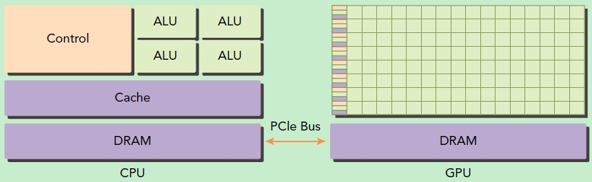
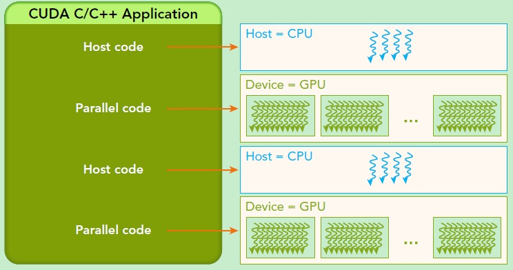
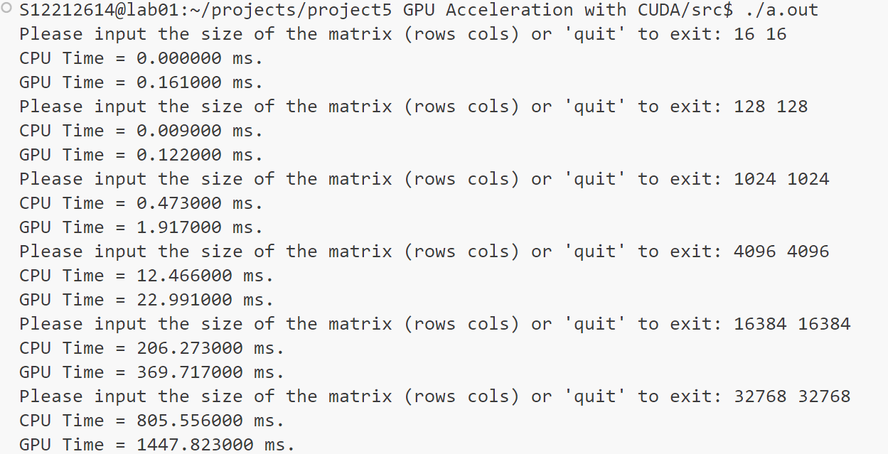
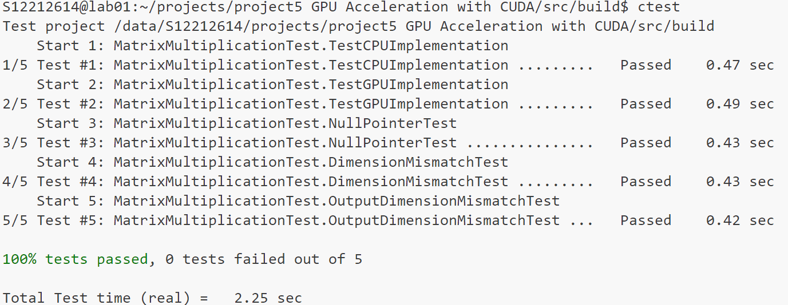
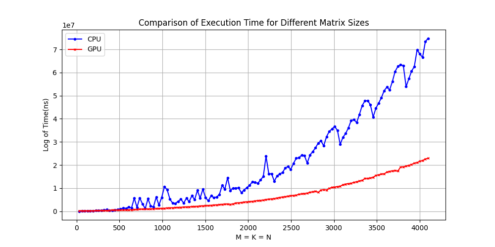
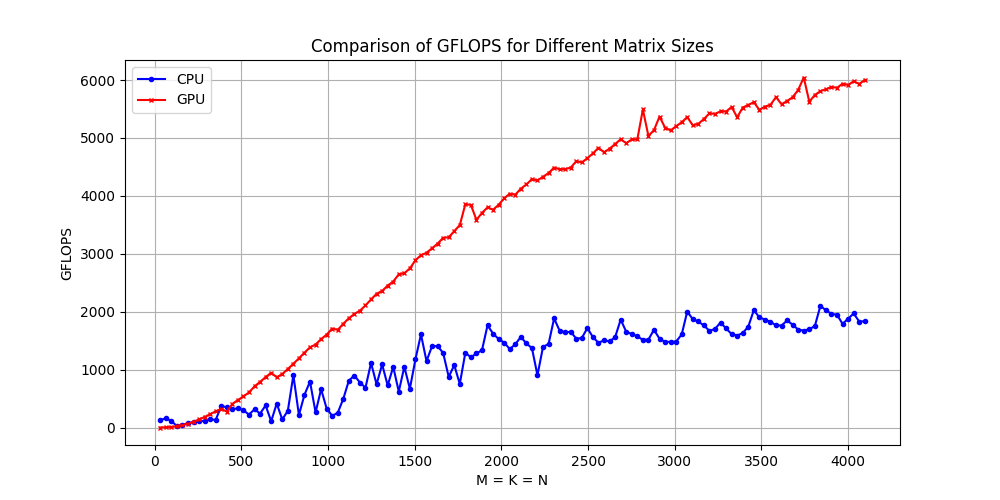
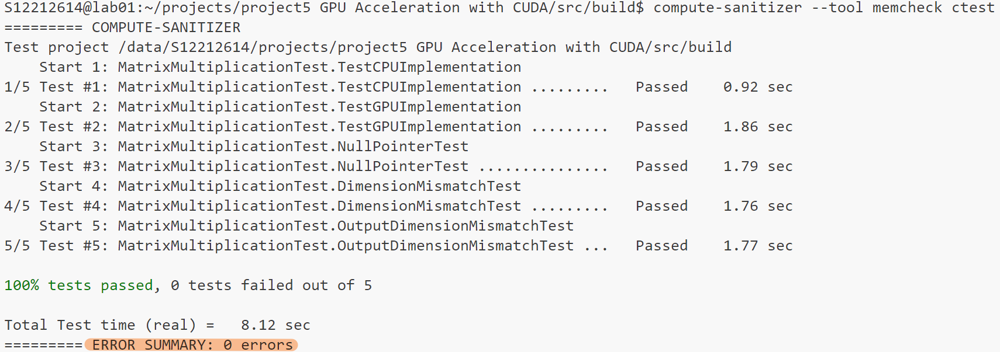

# CS205 C/ C++  GPU Acceleration with CUDA

**Name**: 吴宇贤

**SID**: 12212614

[toc]

上交文档：matrix.h、mulAdd.cu、mul.cu、benchmark.cu、report.pdf

- **matrix.h：**简易的矩阵类
- **mulAdd.cu：**实现**B** = a **A** + b
- **mul.cu：**实现OpenBLAS 库在 CPU 上的计算和cuBLAS 库在 GPU 上的计算
- **benchmark.cu:** 对于mul.cu实现的函数进行单元基准测试，从而比对CPU和GPU在矩阵乘法计算上的优劣。

[git仓库](https://github.com/GetOffENT/cs205-c-cpp-projects/tree/main/project5 GPU Acceleration with CUDA)点此

编译命令：

```cmd
mulAdd.cu:
$ nvcc -O3 mulAdd.cu -o mulAdd.out
```

benchmark.cu: 使用CMake编译

```cmake
cmake_minimum_required(VERSION 3.14)
project(Project LANGUAGES CXX CUDA)

# Enable CUDA
find_package(CUDA REQUIRED)
enable_language(CUDA)

# Set CUDA architectures (you can adjust these according to the target devices)
set(CUDA_ARCHITECTURES 75)

# Add Google Benchmark
set(BENCHMARK_ENABLE_TESTING OFF CACHE BOOL "Suppressing benchmark's tests")
set(BENCHMARK_DOWNLOAD_DEPENDENCIES ON CACHE BOOL "Allow benchmark to download dependencies")
add_subdirectory(tools/benchmark)

# Add the source files
add_executable(benchmark_test src/benchmark.cu src/mul.cu)

# Set CUDA properties for the target
set_target_properties(benchmark_test PROPERTIES CUDA_ARCHITECTURES "${CUDA_ARCHITECTURES}")

# Set compile options for optimization
target_compile_options(benchmark_test PRIVATE -O3)

# Link CUDA and Google Benchmark
target_link_libraries(benchmark_test benchmark::benchmark cuda cublas openblas)
```

## Part 1 - Analysis 

### 1.1 阅读需求

> 1. Implement the expression **B** = a **A** + b, where a and b are scalars, **A** and **B** are matrices of the
>    same size. You can implement it by modifying the example matadd.cu.
> 2. Compare the matrix multiplication by OpenBLAS on CPU with that by cuBLAS on GPU. cuBLAS
>    is a GPU-accelerated library provided by NVIDIA. Do not use some huge matrics, and
>    4096x4096 should be large enough. We have a lot of students to share the server. Surely you
>    can use your computer if you have an NVIDIA GPU.
> 3. (Optional) Something interesting on GPU.

我们可以很直观地看出，这次project首先的开胃菜是要求我们分别实现在CPU和GPU矩阵”乘加“融合运算；随后使用 cblas 库在 CPU 上计算矩阵乘法、使用 cuBLAS 库在 GPU 上计算矩阵乘法，并且比较两者矩阵乘法的效率。

如何衡量两个不同的矩阵库在各自的场景下矩阵乘法的效率呢，这里我进行性能测试的数据都是在M=N=K的情况下，选取GFLOPS（Giga Floating-point Operations Per Second，每秒十亿次浮点运算）作为评价指标。

GFLOPS，可以衡量CPU的throughput。这是一个衡量计算设备性能的指标，主要用于评估计算机、特别是高性能计算机和图形处理单元（GPU）在处理浮点计算任务时的速度。对于$M*K$的矩阵与$K*N$的矩阵相乘，运行时间为t(s) ，其GFLOPS为
$$
GFLOPS = \frac{2mnk}{10^9 *t}
$$
其中，对于运行时间t，使用Google Benchmark测量。题目要求测量 的矩阵，这里我选择[32，4096]区间，以32为步长测量两者计算相同数据量矩阵的时间，随后通过公式计算GFLOPS。

最后，这里的测试使用`-O3`参数用来指定编译器进行高级优化，以尽可能提升程序的执行效率（实测提升基本没有，毕竟矩阵库已经考虑的很全面了）。这样可以程序在运行时达到更快的速度，而这对于性能测试不可或缺，因为我们希望知道程序在最优化状态下的性能表现，尽可能排除其它因素带来的影响，使得比较更加”公平“。

### 1.2 前置知识探究

#### CPU、GPU

CPU（Central Processing Unit）是一块超大规模的集成电路，是一台计算机的运算核心（Core）和控制核心（ Control Unit）。它的功能主要是解释计算机指令以及处理计算机软件中的数据。CPU与内部存储器和输入/输出设备合称为电子计算机三大核心部件。CPU主要包括运算器（算术逻辑运算单元，ALU，Arithmetic Logic Unit）、控制单元（CU, Control Unit）、寄存器（Register）、和高速缓冲存储器（Cache）及实现它们之间联系的数据（Data）、控制及状态的总线（Bus）。因为CPU的架构中需要大量的空间去放置存储单元和控制单元，相比之下计算单元只占据了很小的一部分，所以它在**大规模并行计算能力上极受限制**，而更擅长于逻辑控制。

显卡（Video card，Graphics card）全称显示接口卡，又称显示适配器，是计算机最基本配置、最重要的配件之一。随着显卡的迅速发展，**GPU**这个概念由NVIDIA公司于1999年提出。GPU是显卡上的一块芯片，就像CPU是主板上的一块芯片。集成显卡和独立显卡都是有GPU的。有GPU之后，CPU和GPU就进行了分工，CPU负责逻辑性强的事物处理和串行计算，GPU则专注于执行高度线程化的并行处理任务（大规模计算任务）。GPU并不是一个独立运行的计算平台，而需要与CPU协同工作，可以看成是CPU的协处理器，因此当我们在说GPU并行计算时，其实是指的基于CPU+GPU的异构计算架构。GPU包括更多的运算核心，其特别适合数据并行的计算密集型任务，如大型矩阵运算，而CPU的运算核心较少，但是其可以实现复杂的逻辑运算，因此其适合控制密集型任务。



#### CUDA



CUDA是通过函数类型限定词区别在host和device上的函数，主要的三个函数类型限定词如下：

- **global**：在device上执行，从host中调用（一些特定的GPU也可以从device上调用），返回类型必须是void，不支持可变参数参数，不能成为类成员函数。注意用__global__定义的kernel是异步的，这意味着host不会等待kernel执行完就执行下一步。
- **device**：在device上执行，单仅可以从device中调用，不可以和__global__同时用。
- **host**：在host上执行，仅可以从host上调用，一般省略不写，不可以和__global__同时用，但可和__device__同时使用，此时函数会在device和host都编译。

当然，这次的project老师简化题目，由于可以直接调用cublas矩阵库中对应的矩阵乘法函数，我们不需要过多的关注**网格（grid）**以及**线程块（block）**。

### 1.3 测试前的推测和猜想

GPU拥有成千上万的计算核心，能够同时处理大量数据，而CPU的核心数量相对较少，每核处理能力虽强但并行能力有限，所以对于需要大量并行处理的任务，如大规模矩阵乘法、图像处理、或深度学习模型的训练，GPU将应该表现出显著优于CPU的性能。

CPU的设计优化了单线程的计算速度和效率，时钟频率通常高于GPU，适合处理需要快速响应和复杂逻辑决策的任务。所以在高依赖单线程性能的应用中，如某些类型的数据分析和应用程序逻辑，CPU可能会优于GPU。

## Part 2 - Design and Implement

### 2.1 前期准备

为了能更加专注于矩阵乘加运算和矩阵乘法，不过多的纠结矩阵的存储，我先借鉴project 4提供了一个简单的矩阵类，其中提供了一些函数方便后续操作，如：给矩阵每个元素赋上随机值、将矩阵设为同一值等。

```c++
// matrix.h
template <typename T>
class Matrix
{
public:
    size_t rows;
    size_t cols;
    T *data;        // CPU memory
    T *data_device; // GPU memory
    
    ......
};
```

### 2.2 "乘加"融合运算

这里就按照要求仿写了上课给出的代码`matadd.cu`，并借鉴了代码中的简单运行时间测量方法，这里只是用于提前观察结果，便于推测结论，带着问题去完成后续部分，正式测量在矩阵乘法的部分。

唯一不太相同的是我把函数的参数(kernel函数除外，其只能用指针)从指针 (`const Matrix<T> *`) 改为引用 (`const Matrix<T> &`），我认为这样可以保证传递给函数的 `Matrix` 对象不是 `nullptr`。这使得函数内部不再需要检查 `nullptr`，从而减少了一些运行时错误的可能。其次使用引用可以使得代码更易于理解，调用函数时不需要显式地使用地址运算符 (`&`)，使得函数调用看起来更像是传递常规变量。

错误处理沿用课件的错误处理，虽然无需检测matrix指针是否为`nullptr`，但增加了内部`data`的空指针检测。

```c++
template <typename T>
bool mulAddCPU(const Matrix<T> &pMatA, T a, T b, Matrix<T> &pSptB);

template <typename T>
bool mulAddGPU(const Matrix<T> &pMatA, T a, T b, Matrix<T> &pMatB);
```

然后就是GPU计算最核心的代码（kernel）

```C++
template <typename T>
__global__ void mulAddKernel(const T *inputA, T a, T b, T *outputB, size_t len)
{
    int i = blockDim.x * blockIdx.x + threadIdx.x;
    if (i < len)
    {
        outputB[i] = inputA[i] * a + b;
    }
}
```

函数参数包括一个指向输入数据的常量指针 `inputA`、两个运算所需的标量值 `a` 和 `b`、一个指向输出数据的指针 `outputB`，以及数组的长度 `len`。局部变量 `i` 是计算出的全局索引，基于当前线程所在的block索引 (`blockIdx.x`)、线程在block内的索引 (`threadIdx.x`) 以及每个block的线程数量 (`blockDim.x`) 计算得到，用来确定当前线程应该处理的数组元素位置。这种并行计算方法确保了每个线程安全地处理数组中的一个元素，避免内存访问冲突。

并行性这么突出，加上前面对前置知识的了解，我忍不住做出猜测：小数据下GPU不如CPU，但是随着数据增大增多GPU计算乘加融合运算的时间开始低于CPU。因为在大规模计算中，可以在GPU上利用大规模并行处理，显著加速大数据集上的计算任务，也就是说这特别适用于需要对大量数据进行相同运算的场景。

刚开始初测CPU和GPU的计算效率时，忘记开`-O3`优化，使得结果很符合预期。但是后来复读代码时，发现GPU计算乘加融合运算时，要先从`host`将数据拷贝到`device`上，运算完后要将`device`上的运算结果拷贝到`host`上，而这个拷贝的时间复杂度和计算的时间复杂度是一样的，按理说这部分时间相较于计算的时间是不可以忽略的，所以从纯理论上来说，不管计算速度如何`GPU Time`应该一直大于`CPU Time`，只不过`GPU Time`的增长速度会慢于`CPU Time`。

加上`-O3`优化后，测试结果：



确实GPU Time一直大于CPU Time，这样的结果很完美的印证了我复读代码后改进的推测。而后面利用Google Benchmark按照梯度正式测试时，矩阵乘法`O(n³)`的复杂度下，拷贝的时间随着数据的增大可以忽略不计了，也更方便我们比对CPU和GPU的数据计算能力、计算效率。

其实这里我还发现一个有趣的现象，加上`-O3`优化之后`CPU Time`相较于优化之前确实有很大的提升，但是`GPU Time`确没有什么变化。研究之后发现编译器（如 GCC 或 Clang）会根据 `-O3` 优化指令来执行代码优化，这包括但不限于代码内联、循环展开、指令重排等。而对于 GPU 代码，CUDA 编译器（NVCC）会将 CUDA 代码编译成 PTX (Parallel Thread Execution) 汇编代码，然后再转换为 GPU 执行的机器代码。这一过程中，CPU 代码的优化指令 `-O3` 不直接影响 PTX 代码的生成。虽然 `-O3` 不直接作用于 GPU 代码，但确保 CPU 侧代码的高效执行也很重要，因为很多应用场景如数据准备和传输中都涉及 CPU。

### 2.3 矩阵乘法

这次project没有让我们手写矩阵乘法，我们只需要调用对应矩阵库中的矩阵乘法即可，而这部分主要目的是对比CPU和GPU对于矩阵乘法运算的效率，我直接延用前面的类模板，数据类型使用float即可，至于错误处理与前一部分类似不详细说明了，跟着老师学了这么久cpp有信心对错误处理手到擒来。

#### OpenBLAS 库在 CPU 上的计算

CPU上调用OpenBLAS库的矩阵乘法已经是老生常谈，其实主要就是对于cblas_sgemm参数的理解：

```c++
void cblas_sgemm(OPENBLAS_CONST enum CBLAS_ORDER Order, OPENBLAS_CONST enum CBLAS_TRANSPOSE TransA, OPENBLAS_CONST enum CBLAS_TRANSPOSE TransB, OPENBLAS_CONST blasint M, OPENBLAS_CONST blasint N, OPENBLAS_CONST blasint K,OPENBLAS_CONST float alpha, OPENBLAS_CONST float *A, OPENBLAS_CONST blasint lda, OPENBLAS_CONST float *B, OPENBLAS_CONST blasint ldb, OPENBLAS_CONST float beta, float *C, OPENBLAS_CONST blasint ldc);
```

其中

- Order：输入数组相邻数据是按照行排列还是列排列；
- TransA、TransB：是否对矩阵A进行转置、是否对矩阵B进行转置；
- M ：矩阵A的行，结果C的行（不论是否转置）
- N ： 矩阵B的列，结果C的列（不论是否转置）
- K ： 矩阵A的列，B的行（不论是否转置），结果C的行；
- float *A： 矩阵A的首元素地址；lda：如果A转置，则为转置后A的行数，如果A不转置，则为A的列数；
- float *B： 矩阵B的首元素地址；ldb：如果B转置，则为转置后B的行数，如果B不转置，则为B的列数；
- float *C： 结果C的首元素地址；ldc：结果C的行数；

```c++
bool mulMatrixCPU(const Matrix<float> &lhs, const Matrix<float> &rhs, Matrix<float> &dst)
{
    if (lhs.data == nullptr || rhs.data == nullptr || dst.data == nullptr)
    {
        std::cerr << "Null pointer.\n";
        return false;
    }

    if (lhs.cols != rhs.rows)
    {
        std::cerr << "Incompatible dimensions for multiplication: A.cols != B.rows\n";
        return false;
    }
    if (dst.rows != lhs.rows || dst.cols != rhs.cols)
    {
        std::cerr << "Output matrix dimensions do not match the product dimensions.\n";
        return false;
    }

    const float alpha = 1.0f;
    const float beta = 0.0f;

    cblas_sgemm(CblasRowMajor, CblasNoTrans, CblasNoTrans,
                lhs.rows, rhs.cols, lhs.cols, alpha,
                lhs.data, lhs.cols, rhs.data, rhs.cols, beta, dst.data, dst.cols);

    return true;
}
```

沿用了课件矩阵加法计算返回值为bool的做法。

#### cuBLAS 库在 GPU 上的计算

一开始理所应当地认为`cublasSgemm(···)`函数的调用与`cblas_sgemm(···)`大同小异，无非就是前面几个参数名字的区别，所以其他的部分自然是复制上去，所幸我对于使用两个库计算的结果专门用GoogleTest与暴力算法进行比对发现了cuBLAS 库在 GPU 上的计算有问题。

这里有一个很大的坑，只是cublas不同于C++，是列优先存储，因此参数一不小心设的不对，结果大不相同，如果只是简单的把前面的是否转置的参数改为是后，这样最后得到的结果其实是正确答案的转置，若再人为转置回来我个人认为比较麻烦，我想到的解决方法是利用$$A*B=(B^T*A^T)^T$$的概念，交换矩阵的位置并正确填充其他参数，这样最后的得到的结果就和预期一样了。

至于错误处理比在CPU上计算要多一点，但这个不是重点（详见代码），不过多赘述。

```c++
bool mulMatrixGPU(const Matrix<float> &lhs, const Matrix<float> &rhs, Matrix<float> &dst)
{
    if (lhs.data == nullptr || rhs.data == nullptr || dst.data == nullptr)
    {
        std::cerr << "Null pointer.\n";
        return false;
    }

    if (lhs.cols != rhs.rows)
    {
        std::cerr << "Incompatible dimensions for multiplication: A.cols != B.rows\n";
        return false;
    }
    if (dst.rows != lhs.rows || dst.cols != rhs.cols)
    {
        std::cerr << "Output matrix dimensions do not match the product dimensions.\n";
        return false;
    }

    const float alpha = 1.0f;
    const float beta = 0.0f;
    cublasHandle_t handle;
    cublasStatus_t status = cublasCreate(&handle);
    if (status != CUBLAS_STATUS_SUCCESS)
    {
        std::cerr << "CUBLAS initialization failed\n";
        return false;
    }

    status = cublasSgemm(handle, CUBLAS_OP_N, CUBLAS_OP_N, rhs.cols, lhs.rows, lhs.cols,
                         &alpha, rhs.data_device, rhs.cols, lhs.data_device, rhs.rows,
                         &beta, dst.data_device, dst.cols);
    if (status != CUBLAS_STATUS_SUCCESS)
    {
        std::cerr << "CUBLAS SGEMM failed\n";
        cublasDestroy(handle);
        return false;
    }

    cudaMemcpy(dst.data, dst.data_device, sizeof(float) * dst.rows * dst.cols, cudaMemcpyDeviceToHost);
    cublasDestroy(handle);
    return true;
}
```

## Part 3 - Test and Comparation

### 3.1 矩阵库应用的正确性测试

> 代码见mul_test.cu、src/CMakeLists.txt(未上交，在git仓库),

这一部分看似不是project要求的，但我认为很重要，也正是因为我做了这一步才找到了致命错误，以及了解到了矩阵在GPU中的存储。

我利用GoogleTest结合cmake进行了一系列单元测试，包括矩阵乘法结果的正确性、是否正确处理了错误输入等

部分代码如下：

```c++
//mul_test.cu
class MatrixMultiplicationTest : public ::testing::Test
{
protected:
    Matrix<float> A, B, resultCPU, resultGPU, expected;
    MatrixMultiplicationTest()
        : A(256, 128), B(128, 256), resultCPU(256, 256), resultGPU(256, 256), expected(256, 256)
    {}
    void SetUp() override
    {
        A.randomize();
        B.randomize();
        mul(A, B, expected);
    }
    void TearDown() override
    {
    }
};
// 测试 CPU 计算结果是否正确
TEST_F(MatrixMultiplicationTest, TestCPUImplementation)
{
    ASSERT_TRUE(mulMatrixCPU(A, B, resultCPU));
    for (size_t i = 0; i < resultCPU.rows; i++)
    {
        for (size_t j = 0; j < resultCPU.cols; j++)
        {
            EXPECT_NEAR(resultCPU.data[i * resultCPU.cols + j], expected.data[i * expected.cols + j], 1e-4);
        }
    }
}
// 测试 CPU 计算结果是否正确
TEST_F(MatrixMultiplicationTest, TestCPUImplementation){······(略)}
// 测试输入矩阵为空指针的情况
TEST_F(MatrixMultiplicationTest, NullPointerTest)
{
    Matrix<float> nullMatrix(256, 128);
    nullMatrix.data = nullptr; // 故意将数据指针设置为nullptr

    // 测试 CPU 实现
    EXPECT_FALSE(mulMatrixCPU(nullMatrix, B, resultCPU));
    EXPECT_FALSE(mulMatrixCPU(A, nullMatrix, resultCPU));
    EXPECT_FALSE(mulMatrixCPU(A, B, nullMatrix));

    // 测试 GPU 实现
    EXPECT_FALSE(mulMatrixGPU(nullMatrix, B, resultGPU));
    EXPECT_FALSE(mulMatrixGPU(A, nullMatrix, resultGPU));
    EXPECT_FALSE(mulMatrixGPU(A, B, nullMatrix));
}
// 测试维度不匹配的情况
TEST_F(MatrixMultiplicationTest, DimensionMismatchTest){······(略)}
// 测试输出维度不匹配的情况
TEST_F(MatrixMultiplicationTest, OutputDimensionMismatchTest){·······(略)}
```

结果如下：



一开始是GPU上的计算出了问题，没有考虑到GPU列优先储存，修改后测试全部通过。

### 3.2 CPU vs GPU

> 代码见benchmark.cu（已上交）、CMakeLists.txt（详见报告开头或github仓库）

这里利用服务器新增的git，从github clone了google benchmark仓库，再利用Cmake链接，最后进行单元基准测试。测试的范围为以32为步长的[32,4096]区间。

```
./benchmark_test --benchmark_format=<console|json|csv> > ../results.json
```

使用以上参数将结果输出为json文件，随后使用python中的Matplotlib图形库绘制图像如下：





第一张图为运行时间对比，由于时间跨数量级较多，使用对数尺度来表示执行时间，清晰地展示跨越多个数量级的变化；第二张图为GFLOPS对比，对于两张图的结果分析如下：

#### GPU 性能表现

- **增长趋势**：从图中可以看出，随着矩阵大小的增加，GPU的GFLOPS显著提升，特别是在矩阵大小超过1000之后，GFLOPS急剧上升，尤其凸显了GPU的大规模并行计算能力。
- **原因分析**：如此高的GFLOPS得益于GPU的架构中拥有成千上万的计算核心，能够同时处理大量运算，尤其适合执行像矩阵乘法这种并行度高的任务，这使其能够在执行浮点运算，尤其是线性代数运算如矩阵乘法时，分配任务至多个并行处理单元，从而显著减少计算所需时间。并且cuBLAS库是专为NVIDIA GPU优化的，能够有效利用其并行处理能力。

#### CPU 性能表现

- **性能限制**：与GPU相比，CPU的GFLOPS表现较为平稳，并且在所有500以内矩阵大小下与GPU相差无几，而大于500的矩阵大小后，GPU增长趋势远远大于CPU。
- **原因分析**：CPU的核心数量远少于GPU，虽然CPU的每核时钟频率高，单核性能强于GPU，但在处理需要高并行度的矩阵乘法时，其性能仍然受限于核心数。其次CPU设计优先考虑通用计算和任务的顺序执行，而非并行处理。OpenBLAS虽然是高度优化的线性代数库，可以利用所有CPU核心，但仍然无法与GPU在执行大规模并行计算时的性能相匹配。

#### 结论：

GPU的设计使其在执行并行计算时具有极高效率，特别是在矩阵乘法这种可以分解成多个小任务并行执行的操作中。此外，cuBLAS库为GPU特别优化，进一步提高了其在这些任务上的性能。

虽然CPU可以通过多线程利用多核优势，但其在面对需要大量并行处理的矩阵乘法时，效率不如GPU。随着矩阵大小的增加，CPU处理这些运算的时间急剧增加，显示出其在大规模数据处理方面的局限。

而这样的结果也印证了前面的推测和猜想，在`O(n³)`的复杂度下，随着数据的增多，复制数据的时间可以忽略，从而我们能直观的看到CPU和CPU在大量数据计算时的优劣。

### 3.3 内存泄漏检测

CUDA工具包中提供了一个功能正确性检查套件` Compute Sanitizer `，它通过检查代码是否存在内存访问违规、竞争条件、对未初始化变量的访问以及同步错误，擅长于根本原因调试。

这里我们在用GoogleTest进行单元测试的时候顺便检测一下内存是否泄漏。



如图，内存没有泄漏。

## Part 4 - Conclusion and Thinking

1. **CPU的优势**

   这里的测试GPU占优并不意味着GPU可以替代CPU，CPU设计为执行广泛的计算任务，而非特化于特定类型的计算。CPU可以高效处理包括桌面应用、服务器运营、复杂的业务逻辑处理等广泛的任务。对于不涉及大规模并行处理的应用，CPU通常是更合适的选择。

   CPU的时钟频率通常高于GPU核心的时钟频率，每个核心可以执行更复杂的操作和更多的单线程任务。这意味着对于依赖单线程性能的应用，CPU可能提供更好的性能。

   CPU在处理需要快速响应的任务时表现更佳，例如用户交互和实时系统处理。这得益于CPU更高的时钟频率和更优的任务调度能力。在不需要处理大量并行计算的场景中，使用CPU可能更为成本效率，特别是在初期投资和能耗方面。相较于高端GPU，高性能CPU的成本可能更低，且能源消耗通常也更低。

2. **GPU的优势**

   一个GPU由成百上千个较小、较专用的核心组成，使其能够同时执行大量的计算操作。这种设计使GPU在执行并行密集型任务（如图形渲染、科学计算、大规模矩阵操作）时表现出卓越的性能。

   由于其并行核心的设计，GPU能够在每秒内处理更多的数据。例如，在进行图像处理或视频解码等操作时，GPU能够同时处理多个像素点，而CPU则需要顺序处理每个像素点。加之GPU支持特定的计算指令集，这些指令专门优化用于图形处理和复杂的数学运算，如浮点运算和向量计算，这使得GPU在执行科学模拟和深度学习等任务时更加高效。

   我个人还认为有一个点不可忽略，随着AI技术的发展，尤其是在自然语言处理（NLP）、计算机视觉、机器学习和其他领域中，模型变得日益复杂，数据集也越来越大。例如，从原始的CNN和RNN到现在的Transformer和GPT系列模型，这些模型涉及到的参数数量从数百万增加到数十亿甚至更多。这种规模的计算需求远远超出了CPU的处理能力，而GPU以其强大的并行处理能力成为了首选硬件。

3. **CUDA的学习和应用**

   通过这次project，我了解了CUDA这种技术尤其适用于需要大量计算和数据处理的任务，如深度学习和机器学习等等。CUDA作为一种通用的并行计算框架，其应用远不止矩阵乘法和传统意义上的“图形处理”。其能力涵盖了从科学研究到商业应用的广泛领域，为处理大规模计算任务提供了强大的加速能力。随着技术的发展和更多领域的探索，我认为CUDA的应用将更加广泛。

## Part 5 - Source Code

### matrix.h

```c++
//matrix.h
#ifndef MATRIX_H
#define MATRIX_H

#include <iostream>
#include <cuda_runtime.h>
#include <random>
template <typename T>
class Matrix
{
public:
    size_t rows;
    size_t cols;
    T *data;       
    T *data_device; 

    // Constructor
    Matrix() : rows(0), cols(0), data(nullptr), data_device(nullptr) {}
    Matrix(size_t r, size_t c) : rows(r), cols(c), data(nullptr), data_device(nullptr)
    {
        size_t len = r * c;
        if (len == 0)
        {
            std::cerr << "Invalid size. The input should be > 0." << std::endl;
            throw std::invalid_argument("Matrix dimensions should be greater than 0.");
        }
        data = (T *)malloc(len * sizeof(T));
        if (data == nullptr)
        {
            std::cerr << "Allocate host memory failed." << std::endl;
            throw std::bad_alloc();
        }
        memset(data, 0, len * sizeof(T));

        cudaError_t status = cudaMalloc(&data_device, len * sizeof(T));
        if (status != cudaSuccess)
        {
            std::cerr << "Allocate device memory failed." << std::endl;
            free(data);
            throw std::bad_alloc();
        }
        cudaMemset(data_device, 0, len * sizeof(T));
    }

    // Destructor
    ~Matrix()
    {
        free(data);
        cudaFree(data_device);
    }

    // Set all elements to the same value
    void set(T value)
    {
        size_t len = rows * cols;
        for (size_t i = 0; i < len; i++)
        {
            data[i] = value;
        }
        // Also update GPU memory
        cudaMemcpy(data_device, data, len * sizeof(T), cudaMemcpyHostToDevice);
    }

    // Randomize matrix elements
    void randomize()
    {
        std::random_device rd;                          // Obtain a random number from hardware
        std::mt19937 gen(rd());                         // Seed the generator
        std::uniform_real_distribution<> dis(0.0, 1.0); // Define the range

        size_t len = rows * cols;
        for (size_t i = 0; i < len; i++)
        {
            data[i] = static_cast<T>(dis(gen)); // Generate random float number and assign it
        }
        // Copy updated data to GPU memory
        cudaMemcpy(data_device, data, len * sizeof(T), cudaMemcpyHostToDevice);
    }

    // Print matrix elements
    void print() const
    {
        for (size_t i = 0; i < rows; i++)
        {
            for (size_t j = 0; j < cols; j++)
            {
                std::cout << data[i * cols + j] << " ";
            }
            std::cout << std::endl;
        }
    }

    // Overload << operator for output
    friend std::ostream &operator<<(std::ostream &os, const Matrix &mat)
    {
        for (size_t i = 0; i < mat.rows; i++)
        {
            for (size_t j = 0; j < mat.cols; j++)
            {
                os << mat.data[i * mat.cols + j] << " ";
            }
            os << std::endl;
        }
        return os;
    }

    // Overload >> operator for input
    friend std::istream &operator>>(std::istream &is, Matrix &mat)
    {
        for (size_t i = 0; i < mat.rows * mat.cols; i++)
        {
            is >> mat.data[i];
        }
        // Also update GPU memory
        cudaMemcpy(mat.data_device, mat.data, mat.rows * mat.cols * sizeof(T), cudaMemcpyHostToDevice);
        return is;
    }

    size_t getRows() const { return rows; }
    size_t getCols() const { return cols; }
};

template <typename T>
bool mulAddCPU(const Matrix<T> &pMatA, T a, T b, Matrix<T> &pSptB);

template <typename T>
__global__ void mulAddKernel(const T *inputA, T a, T b, T *outputB, size_t len);

template <typename T>
bool mulAddGPU(const Matrix<T> &pMatA, T a, T b, Matrix<T> &pMatB);

bool mulMatrixCPU(const Matrix<float> &matA, const Matrix<float> &matB, Matrix<float> &matC);

bool mulMatrixGPU(const Matrix<float> &matA, const Matrix<float> &matB, Matrix<float> &matC);

bool mul(const Matrix<float> &lhs, const Matrix<float> &rhs, Matrix<float> &result);

#endif // MATRIX_H
```

### mulAdd.cu

```C++
#include <cstdio>
#include <iostream>
#include <sstream>
#include <cuda_runtime.h>
#include <sys/time.h>
#include "matrix.h"

#define TIME_START gettimeofday(&t_start, NULL);
#define TIME_END(name)                                         \
    gettimeofday(&t_end, NULL);                                \
    elapsedTime = (t_end.tv_sec - t_start.tv_sec) * 1000.0;    \
    elapsedTime += (t_end.tv_usec - t_start.tv_usec) / 1000.0; \
    printf(#name " Time = %f ms.\n", elapsedTime);

template <typename T>
bool mulAddCPU(const Matrix<T> &MatA, T a, T b, Matrix<T> &MatB)
{
    if (MatA.data == nullptr || MatB.data == nullptr)
    {
        fprintf(stderr, "Null pointer.\n");
        return false;
    }
    if (MatA.rows != MatB.rows || MatA.cols != MatB.cols)
    {
        fprintf(stderr, "The input and output matrices are not the same size.\n");
        return false;
    }

    size_t len = MatA.rows * MatA.cols;
    for (int i = 0; i < len; i++)
    {
        MatB.data[i] = MatA.data[i] * a + b;
    }
    return true;
}

template <typename T>
__global__ void mulAddKernel(const T *inputA, T a, T b, T *outputB, size_t len)
{
    int i = blockDim.x * blockIdx.x + threadIdx.x;
    if (i < len)
    {
        outputB[i] = inputA[i] * a + b;
    }
}

template <typename T>
bool mulAddGPU(const Matrix<T> &MatA, T a, T b, Matrix<T> &MatB)
{
    if (MatA.data == nullptr || MatB.data == nullptr)
    {
        fprintf(stderr, "Null pointer.\n");
        return false;
    }
    if (MatA.rows != MatB.rows || MatA.cols != MatB.cols)
    {
        fprintf(stderr, "The input and output matrices are not the same size.\n");
        return false;
    }

    cudaError_t ecode = cudaSuccess;
    size_t len = MatA.rows * MatA.cols;

    cudaMemcpy(MatA.data_device, MatA.data, sizeof(T) * len, cudaMemcpyHostToDevice);
    mulAddKernel<<<(len + 255) / 256, 256>>>(MatA.data_device, a, b, MatB.data_device, len);
    if ((ecode = cudaGetLastError()) != cudaSuccess)
    {
        fprintf(stderr, "CUDA Error: %s\n", cudaGetErrorString(ecode));
        return false;
    }
    cudaMemcpy(MatB.data, MatB.data_device, sizeof(T) * len, cudaMemcpyDeviceToHost);

    return true;
}

int main()
{
    struct timeval t_start, t_end;
    double elapsedTime = 0;

    int rows, cols;
    std::string input;

    while (true)
    {
        std::cout << "Please input the size of the matrix (rows cols) or 'quit' to exit: ";
        std::getline(std::cin, input); 

        if (input == "quit")
        {
            break; 
        }

        std::istringstream iss(input);
        if (!(iss >> rows >> cols))
        {
            std::cerr << "Invalid input.\n";
            continue;
        }

        Matrix<float> matA(rows, cols);
        Matrix<float> matB(rows, cols);
        matA.set(1.0);
        matB.set(0.0);

        TIME_START;
        mulAddCPU<float>(matA, 2.0, 3.0, matB);
        TIME_END(CPU);
        // matB.print();

        TIME_START;
        mulAddGPU<float>(matA, 2.0, 3.0, matB);
        TIME_END(GPU);
        // matB.print();
    }
    return 0;
}
```

### mul.cu

```C++
#include "matrix.h"
#include <cublas_v2.h>
#include <cblas.h>
#include <iostream>

// 使用 cblas 库在 CPU 上计算矩阵乘法
bool mulMatrixCPU(const Matrix<float> &lhs, const Matrix<float> &rhs, Matrix<float> &dst)
{
    if (lhs.data == nullptr || rhs.data == nullptr || dst.data == nullptr)
    {
        std::cerr << "Null pointer.\n";
        return false;
    }

    if (lhs.cols != rhs.rows)
    {
        std::cerr << "Incompatible dimensions for multiplication: A.cols != B.rows\n";
        return false;
    }
    if (dst.rows != lhs.rows || dst.cols != rhs.cols)
    {
        std::cerr << "Output matrix dimensions do not match the product dimensions.\n";
        return false;
    }

    const float alpha = 1.0f;
    const float beta = 0.0f;

    cblas_sgemm(CblasRowMajor, CblasNoTrans, CblasNoTrans, lhs.rows, rhs.cols, lhs.cols,
                alpha, lhs.data, lhs.cols, rhs.data, rhs.cols,
                beta, dst.data, dst.cols);

    return true;
}

// 使用 cuBLAS 库在 GPU 上计算矩阵乘法
bool mulMatrixGPU(const Matrix<float> &lhs, const Matrix<float> &rhs, Matrix<float> &dst)
{
    if (lhs.data == nullptr || rhs.data == nullptr || dst.data == nullptr)
    {
        std::cerr << "Null pointer.\n";
        return false;
    }

    if (lhs.cols != rhs.rows)
    {
        std::cerr << "Incompatible dimensions for multiplication: A.cols != B.rows\n";
        return false;
    }
    if (dst.rows != lhs.rows || dst.cols != rhs.cols)
    {
        std::cerr << "Output matrix dimensions do not match the product dimensions.\n";
        return false;
    }

    const float alpha = 1.0f;
    const float beta = 0.0f;
    cublasHandle_t handle;
    cublasStatus_t status = cublasCreate(&handle);
    if (status != CUBLAS_STATUS_SUCCESS)
    {
        std::cerr << "CUBLAS initialization failed\n";
        return false;
    }

    status = cublasSgemm(handle, CUBLAS_OP_N, CUBLAS_OP_N, rhs.cols, lhs.rows, lhs.cols,
                         &alpha, rhs.data_device, rhs.cols, lhs.data_device, rhs.rows,
                         &beta, dst.data_device, dst.cols);
    if (status != CUBLAS_STATUS_SUCCESS)
    {
        std::cerr << "CUBLAS SGEMM failed\n";
        cublasDestroy(handle);
        return false;
    }

    cudaMemcpy(dst.data, dst.data_device, sizeof(float) * dst.rows * dst.cols, cudaMemcpyDeviceToHost);
    cublasDestroy(handle);
    return true;
}
```

### benchmark.cu

```C++
#include "benchmark/benchmark.h"
#include <functional>
#include "matrix.h" 

using namespace std;
using func_t = function<bool(const Matrix<float>&, const Matrix<float>&, Matrix<float>&)>;

// Executor 类用于执行测试
class Executor {
public:
    explicit Executor(func_t func) : func(std::move(func)) {}

    void execute(benchmark::State &state) {
        const size_t N = state.range(0);

        Matrix<float> lhs(N, N);
        Matrix<float> rhs(N, N);
        Matrix<float> dst(N, N);

        lhs.randomize();
        rhs.randomize();

        for (auto _ : state) {
            func(lhs, rhs, dst);
            benchmark::DoNotOptimize(dst.data);
            benchmark::DoNotOptimize(dst.data_device);
            benchmark::ClobberMemory();
        }
        state.SetComplexityN(state.range(0));
    }
private:
    func_t func;
};

#define ADD_BENCHMARK(FUNC, BENCHMARK_NAME) \
    static void BENCHMARK_NAME(benchmark::State &state) { \
        Executor(FUNC).execute(state); \
        state.SetComplexityN(state.range(0)); \
    } \
    BENCHMARK(BENCHMARK_NAME)->DenseRange(32, 4096, 32)->Complexity(benchmark::oNCubed);

ADD_BENCHMARK(mulMatrixCPU, BM_MulMatrixCPU);
ADD_BENCHMARK(mulMatrixGPU, BM_MulMatrixGPU);

BENCHMARK_MAIN();
```

